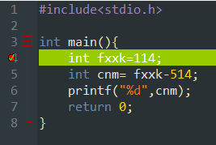

## 第一周
### 程序的执行
- 解释：用一个能试图读懂你的程序的程序去执行你的程序
	- 将你的程序放进black box里去执行
- 编译：用一个类似翻译的程序去将你的程序翻译为机器直接明白（机器语言）的程序，进而直接执行你的程序
	- 将你的程序转换为机器语言后再由电脑执行
- 而C语言是一个程序语言的编译器（当然也有人做了相应解释器）
	- 有确定的运算性能，同一段代码在啥机器上都一样速度
- python是解释性的语言，直接拿源代码就能执行
	- 缺点是慢，但机器本身算力足够就没什么差别
- 语言本身即可解释也可编译
---
### C与其他语言的关系及适用范围
- C语言是一种基础的语言，其他语言都与其有很多类似的地方（变量等）
- 对于所要解决的事情的特点，有能够与之相关的"库”的语言会有较高的适用性，同时还有传统的原因（以前就用的xx，所以现在也用xx）
### C语言是一种工业语言
- 用于操作系统，嵌入式系统，驱动程序，底层驱动，图形引擎，图像处理，声音效果
	因此注重于开发效率，不用于开发日常应用，主要是练习代码
-  C需要被编译才能运行——需要编辑器（软件）+编译器 or IDE（集成开发环境）
### 实例碎片knowledge
1. 输出hello world的代码
	1. 
2. 手动输入一下

>#include<stdio.h>
>
>int main()
>{
>	printf("Hello World!\n");

>	return 0;
>}

不加换行符的情况：

3. 代码书写完成后点击“编译”可以测试是否通过编译（即是否出现“成功”字样）
	-  或者直接点编译运行即可
4. C语言的固定框架：
	-  
5. 对分号”;“的认识
	- 分号是一段可执行语句的结尾标志，但不一定要紧挨着该行代码的末端，可以在代码和分号之间隔若干空格或若干行
6. **不要用中文！！！**

### 关于printf与计算
- ==printf()输出函数中逗号的右边可以输入运算式==——这意味着你==不用==引入新变量来存储这个运算结果！！！！
	- 例：

## 变量
- 引入：算找零
	- 你想有一个程序能够让你输入任意数字后会得到需要的结果，而不用每次都重新编一个程序来计算。
	- 那么需要有三个事需要解决：
		- 数字放在哪？
		- 数字怎么输入？
		- 数字怎么参加计算？
	- 关于输入：
		- 输入是在终端窗口中
		- 在我们输入东西时，是以行为单位的，就是说在你输入完东西之后再按下enter的时候我们的输入行为就结束了。

---

- **变量**：是一个用于保存数据的“地方”（place）。
	- 例：int price = 0;
	- 上面的int指一种变量类型，price是变量的名字，0是price的初始值。
	- 变量的一般形式：类型名称 + 变量名称 ；
	- 一行中可定义多个变量，两个变量之间用逗号隔开，例
		- int man,what,can,i,say;
		- man,what,can,i,say均为同一类型变量
	- 变量是一种标识符（或标识符）。而标识符用来区别不同名字（name）。
	- 标识符的构造规则：
		- 由字母，数字和下划线组成，并且第一个符号不能用数字。
		- 关键字（或保留字）不能被用于定义标识符名字。
- 变量赋值的解释
	- 对于a=b，在数学中表示一种静态的关系，但在计算机C语言中表示一种赋值动作
	- 即“将b的值赋予给a“的动态过程。
- 初始化：给一个变量在被使用前赋一个值。
	- 未初始化而直接使用（例如printf这个值）就会直接输入其在内存中的值。
	- 可在定义时在同一行初始化多个变量。
	- 初始化所赋的值可以是一个数或者表达式，例如
- 变量类型：C语言中每个变量都应该在最开始就定义/声明其类型（否则无法识别）
	- 变量的声明可以在return之前的任意地方（C99标准）
- 输出函数scanf：格式为scanf("%d",&变量名)
	- 函数里边的”“中是用户输入的内容，且必须根据其格式输出
	- 比如%d%d——12，%d,%d——1,2，price%d %d——price1 2

- 类型const int：其中const表示不变的，int为整型，亦即常数。
	- 格式——const int WCNM;常数变量名英文必须是大写用以与其他变量区分
	- 因此可以用此方式去代替编程中出现的常数，方便能够进行整体的修改
	- 经过这种方式定义的变量WCNM不能够再次被用作赋值操作，否则报错。
- 浮点数：计算机中即是指带小数的数。
	- 输出浮点数
		- 那么printf中得是%f等类似的格式，scanf中是%lf。
		- 定义变量时也需用浮点型类型如：double
- double（一个双精度浮点数类型）：对应的输入数字的格式字符为lf，即%lf。输出字符对应为%f。
- float（单精度浮点数类型）
- 关于格式符的对齐问题：
	- 首先，域宽指的是字符的总长度（包括小数点）
	- %4d——表示域宽为4（至少保留加上小数点后一共4个字符输出，假如只有3个数114，那么输出时会在左边加上1个空格来补足这个字符），输出4个字符（实际位数大于4那这个4就没用），默认右对齐
	- %-4d——除了是左对齐外和上边没什么不同。
	- %4.3f——表示按宽度4输出，输出3位小数（小数点之后的数字，会进行四舍五入）
---

- 表达式：一系列运算符和算子的组合。
	- 运算符：一个运算动作
	- 算子：参与运算的值

---

- 运算符：加减乘除取余括号取正取负赋值——共9种
	- 取正就是a=+a，不变，是一个单目运算，亦即只有一个变量/数参与运算
	- 取负——a=-a,变成相反数，也是单目
	- 加——a=a+b，是双目运算
	- 括号首先，取正负最先，乘除取余其次，然后加减，最后赋值。
	- 结合关系：单目运算和赋值都是从右向左，双目就是从左向右。

---

- （套路）**交换变量**：
	- 思路：当我们想要交换两个变量的值时，可以通过赋值运算符实现这件事。
	- 那么对于 int a = 114 , b = 514;我们想要交换ab的值，那么不能想当然的写
	- a=b
	- b=a
	- 上面这种做法，它最终的效果就会导致a和b的值都为514。这是我们不想看到的。
	- 那么就需要引入一个中间变量存储a或者b的初始值，再进行赋值运算，从而实现变量的值的交换。如下
	- int yctf = a;
	- a=b;
	- b=yctf;
	- 这样就实现了。
- （知识点）**调试**：
	- 调试是用来观察程序的运行状态进而排查bug的工具
	- 其做法是先在左侧表示行数的数字列中单击想要在调试时停住的行使其整行变成高亮
	- 然后再单击这个勾的按钮进入调试。
	- 鼠标移至变量名时即可显示其当前的值。
	- 高亮行之前的行都执行过，而高亮行
	- 在下方操作栏中”下一步“可以将高亮变为下一行，依次直到最后行。

---

- **复合赋值**：
- 格式为前面一个除赋值运算符以外的运算符后边紧接一个赋值运算符，如下
- 
- 代码为：
	- ```
```C
#include<stdio.h>

int main(){
	int a=810;
	a += 1919;
	printf("%d\n",a);
	a -= 1919;
	printf("%d\n",a);
	a *= 114+514;
	printf("%d\n",a);
	a /= a/810;
	printf("%d\n",a);
	a=5;
	printf("now it is fixed to %d\n",a);
	printf("%d\n",a++);

	printf("%d\n",a);

	printf("%d\n",++a);
	
	printf("%d\n",a); 
	return 0;
}
```
- 执行效果为
- 需要注意的还有自增与自减运算符
	- 分为前缀与后缀
	- 例如a++即是表示为一个表达式，值为自增之前的值，在执行后a的值才会变，如上所示5变成6
	- 例如++a也是表达式，值为自增后的值，如上6变成7.

---

- **if判断**：```
```C
if(u==114514){
printf("nishishabi");
}

```

- 格式如上。
- if括号中进行的运算成为**关系运算**
	- 等于是\==\，不等于是!=，其余就是大于小于大于等于小于等于
	- 关系运算的结果是整数1或者整数0，也即真与假。
	- printf("%d\n",5>3);
	- 上述代码经执行后会打印出1.
	- 连续的多个关系运算是从左向右进行的
	- 关系运算符的优先级比算术运算符低，比复制运算符高。其中的\==\和！=的优先度比其他低。
	- 也就是说编程中进行的判断实质是判断结果是1还是0，前者就是对的，正确的，那么会相应进行接下来的一些事情，反之就不做相应事情。

---

- **注释**：
	- 单行注释为——//+语句
	- 多行注释为——/*+语句+下一行语句+···+最后一行*/（两个/之间有个*）
	- 注释增加代码可读性。
	- 另一个作用是把某一行存疑代码加注释后让计算机跳过这条代码，进而观察该代码对整体或局部的影响。

---

- **if+else判断**：
	- 例```
```C
//常规格式不写了
if(114>514){
printf("it's my go!!!!!");
}
else{
printf("you are baga.");
}
if(1>0)
printf("yes,ass we can.");
```

- 厄厄
	- 格式如上所示。
- if和else之后可以有大括号也可以没有，但是有大括号时能够执行的语句会更多，没有大括号时只能拥有与控制紧跟的后边一行语句（末尾有；）。
- 在没有大括号的情况下，else只与最近的if相匹配；在有大括号的情况下，else与最近的if右大括号的if相匹配。
- 所以最好还是每个if和else后边都接上大括号。

---

- **if-else嵌套**：
- ```
```C
if(3>1){
	if(114>411){
	printf("ni tian");
	}
	else{
	printf("shabi");
	}
}
else{
printf("ni shi zhu bi");
}
```


- 像上面这样就是ifelse的简单嵌套。

---

- **级联if -else if-else**：
	- ```
```C
if(1>-114){
int a=114;
}
else if(1<810){
int b=810;
}
else{
printf("%d %d",a,b);
}
```

- 如上所示为级联，也称多分支if-else语句，优点为使版面整齐。

---
- switch-case多路分支语句：
	- 例```
```C
switch(a){
case 1:{printf("u are sb");break;}
case 2:{printf("u are sb and ");}
case 3:{printf("jbwy");break;}
case 4:{printf("u are sb");break;}
default :{printf("u are real shaluan");break;}
}
```

- 代码大致如上。
- 须注意的点是，每个case是一种“入口”，运行：之后的语句后如果没有break；语句则会自动往下执行下一个case的语句无论你这个a是否为相应的整数。
- 例如如果int a=2；则会打印出u are sb and jbwy然后才停止。
- default的作用相当于else{}。
- printf其实应该尽量的少,要符合“单一出口”原则。

---
- **while循环**：
	- 例```
```C
int a= 114,b=0;
while(b<=3){
a/10;
b++;
}
printf("%d",a);
```

- 以上为格式。将会打印0这个数字。
- 与所有循环语句一样的，大括号里头的”循环体“得有产生变化的语句，否则进入死循环。
- 与其他判断结构一样，这里while括号中的关系运算结果决定了是否进入这个循环体。

---
- **do-while循环**：
	- 例
	- ```
```C
int a=514114;
do
{
a/10;
b=a;
}while(b==a/100);
```

- 以上为格式。与while不同的是循环体会比判断更先一步。先do了再判断是否满足条件要不要再do。

---

- **for循环**：
	- 格式为for（语句1；语句2；语句3）{语句4}；
	- 其中语句1表示初始动作，就是进入到for循环后首先要做的事，但是也可以==空着也就是不做==。
	- 语句2关系语句用于判断，和之前一样。
	- 语句3是完成循环体后要做的动作。当然也可以省略，那么此时产生变化的语句就会包含在循环体中。
	- 语句4是循环体，同上。
	- 但是“产生变化”的语句，可以包含在语句3，也可以包含在语句4中。但一般在语句3中。
	- for作为一种古老的循环语句，其作用类似于一种计数器。
	- for循环和while循环是等价的循环语句，这意味着两种语句在功能上可以互相替代与改写。

---
- **三种循环的选择与使用**：
	- 有固定次数的——for
	- 必须执行至少一次——do while
	- 其他情况用——while

---
- **循环控制语句break and continue**：
	- 正如字面意思所说，这俩语句是用在三中循环语句中的，用于控制循环的进行。
	- 在循环体中使用了break后，此时程序就会跳出break所属的整个循环语句，然后接着进行下一个语句。
	- 而使用continue时，程序会跳过循环体中continue以后的所有语句。然后进入到“下一轮循环”中。也就是说，循环还在进行，直至条件满足后离开循环。

---
- 循环的嵌套：
	- 注意不同循环之间的循环变量要有所区别，不能全部一样。
	- 循环的嵌套中如果想对整体的循环做控制，则需要一种trick——接力break。
		- 就是做我们要设置一种判断点，例如
		- 我们设置了一个exit，且利用关系运算和if的特性，来做一个接力break，上述代码中如果找到了一组方案，那么就打印balabla，然后将exit的值由0改为1，从而启动后续的if语句，完成break的接力。
	- 另一种方法是用goto语句
		- 格式，例
		- 上面”goto out；“加上跳转到的点“out：”就是goto语句的主干，意思是从gotoout开始跳到转到out：之后的语句并继续执行。
		- 一般不用goto，除非是这种特殊情形。

---

- **数据类型**：
	- 整数——char，short ,int ,long ,long long
	- 浮点数——float，double，long double
	- 逻辑——bool（布尔）
	- 指针类型
	- 自定义类型
- 输出的格式化：
	- %d , %ld , %lf      (l是long的缩写)
- 表达的数范围比较：
	- char<short<int<float<double\>
- sizeof——计算某数据字节量的运算符
	- 例
	- 是静态运算符，其只会计算括号中数据的字节量而不会进行括号内的运算。
	- int是用来表达寄存器的。
- **整数的字节**：
	- char：1字节（也就是8位二进制数，但是作为机器数，其最左端的一位作为符号位）
		- 范围——-128~127（分为负的，0，还有正的三个部分，总共256个数。）
	- short：2字节（16位）
		- 范围——-32768~32767（就是2的16次方个数分成三部分）
	- int：取决于CPU编码长度(现在64bit最常见，但32bit还是存在的)，主要是8字节，还有4字节。（通常意义为一个字）
	- long：4字节
	- long long：8字节
		- 范围——-9223372036854775808~9223372036854775807
- 去掉符号位加上**前缀unsigned-** 或者**后缀U**
	- 例unsigned-long或者longU，则其正数范围就翻倍，而负数没了。
- 计算机内进行计算的类比——整数环图
	- 
	- 顺逆时针“走”表示-与+。
	- 数字按图示顺序摆好。
	- -128-1=127——也就是由-128的位置顺时针走1到了127.
	- 同理unsigned类型也一样。
- 输出与输入格式符：
	- printf中%d指的是计算机会以十进制整数的格式读取并打印这个数（二进制），最终为打印为十进制整数。
	- 那么scanf中%d就是计算机会以十进制整数的格式读取并存储这个数（二进制），存储在某变量时其实际上还是二进制数，不过当你以%d来printf它时还是十进制整数。
	- 这取决与你如何使用的这个数。
	- %d用于读取的数字大小小于int的情况，%u表示不读取符号位，直接读取这个纯二进制数为整数（大小限制和int一样），%ld用于比int情况大的数，%lu同理。
- **一般情况整数就用int就行。**

---

- 关于**浮点数**：
	- 用double和float表示
	- float——字长32（也就是32位二进制数）
		- 有效数字为7
		- 范围+-（1.20*\10^(-38)~3.40*\^(-38)）和0，还有+-inf（正负无穷大），nan（非有效数字如0.00）
	- double——字长64
		- 有效数字范围为15
		- 范围更大，比你ass体积的倒数的114514倍还大。
	- 格式符
		- float的输出（scanf）输入（printf）都用%f，输出还可以由%e/%E（会输出以科学计数法表示的数）。
		- double输入用%lf，输出用%e/%E还有%f。
		- 可以在%和f之间加上.n表示精确到小数点后n位（四舍五入）的数字
		- 但要注意有效数字的长度，否则就尴尬了。
	- 浮点数可以表示正负无穷大和无效数字比如
		- printf("%f",10.0/0.0)  就是inf（表示正无穷大）
		- printf("%f",0.0/0.0)  就是nan-无效数字
			- 注意1：printf("%d",0/0)就会报错，因为计算机中整数不能除以0，和数学一样。
			- 注意2：一个变量a=1.234就这么写，那么其字面量是double，而a=1.234f就是float类型，也就是说，直接输入一个小数就直接会被当做double类型读取。
			- 注意3：两个浮点书不能直接用\==\连接，有可能会失败，更好的方法是用绝对值符号fabs()，来算fabs(f1-f2)得到的值与1e-12或者1e-8比较，如果小于那么就可以算相等了。

---

- **字符类型**（要用的时候再整理吧）：char
	- char既是一个整数也是一个字符，因为：
		- 单引号可以表示的字符字面量'1'和'a'还有' '都是char所支持的
	- 格式符为%c

---

- 逃逸字符：
	- 怎么会叫这个勾吧名字
	- 常用的就 \\n换行(厄厄你懂就行)还有\\t到下一个制表位（像excel那种）

---
- 类型转换：
	- 自动类型转换：
		- 在运算符两边：整与整——小转大，整与浮——浮，浮与浮——小转大
		- 在printf中小于int的都转为int，float都会转为double
		- scanf不会，若为short那么%hd
	- 强制类型转换：大转小
		- 格式——（类型）值
		- 注意安全性——小的不总能表示大的，例如（short）32768 == -32768
		- 优先级高于四则运算，小于括号

----

- bool逻辑类型：
	- 使用前写出#include<stdbool\>
	- 就可以使用bool，true，false。
	- 例：```
```C
#include<stdio.h>
#include<stdbool>
....
bool a = 114<514;
printf("%d",a);
...

```

- 就会输出1，表示一个布尔量。

---
- 逻辑运算：是对逻辑量（0和1）做的运算，结果就是逻辑量
	- 逻辑量：是关系运算和逻辑运算的结果。
	- 有三种运算——与或非
	- 与——&&
	- 或——||
	- 非——！
- 短路：对于&&和||两种运算，其由左到右进行，当左边的值为可以确定整个运算的值时就不做右边的后续运算
	- 那么别你妈的吧运算式放逻辑运算表达式里头。
---

- 条件运算和逗号运算：
	- 条件运算：由?和:组成，例m>n? m : n ;表示对m>n的逻辑量做判断然后如果是真，那么这一坨的结果就是m的值否则就是n的值。
		- 注意：别几把嵌套多个条件运算，不然说的非人话，到时候看不懂就麻了。
	- 逗号运算：厄厄
		- 例子for（i=0，j=10；i<j；i++，j--）；那么每个由分号间隔开的区域就可以由，来组成多个语句。
		- 没什么几把用。
		- 但注意，（1，4）是一个运算式，结果是4，也就是逗号后边的值。
---

- **函数**（重头戏）
	- 定义：是一个代码块，像一种自动化脚本。
	- 作用：接受单个或多个参数，做一件事，然后返回0给或一个值。
	- 格式：```
```C
void sum(int begin,int end )
{
	int i;
	int sum=0;
	for(i=begin; i <= end ;i++ ){
	sum += i;
	}
	printf("%d到%d的和是%d"，begin，end，sum)；
}
```

- void是一种返回类型，类型说明符，表示没有返回值。
- sum是所定义的函数名称。
- （）是一个函数名后紧跟的，必要的东西，里边可以是空的。
- 如果圆括号里头有东西，那就叫参数表。
- 花括号里头的叫函数体，是函数的具体内容，会执行的一系列语句。

- 后续调用时需要完整输入函数名（）的形式，少了括号会警告函数未被调用。
- 调用时需要按照参数表中正确的顺序与类型去输入相应的数据。这些数据会初始化函数中的一些变量。

- 函数的返回——return：
	- 两类，一种时return一个值，另一种就是不返回任何值，取决于你所使用的返回类型，前者就用像int，double，后者就用void。
	- 例：
	- 上述我定义了两个函数wcnm和nmlgb，其中前者会返回nmmsl的值，而后者不会返回任何值，但是还是做了一些事的。
	- 关于return
		- 意义：停止程序的执行，并返回一个值。
		- 写法：
			- 一种：return；
			- 一种：return+值或者表达式；
	- 从函数中返回的值可以参与语句的执行，比如上述的c =wcnm语句，就是把return返回的值赋值给c，还可以再次进入到函数中，还可以丢弃比如void。
- 函数原型：
	- 由于c编译器是自上而下去读代码的，所以如果你定义了一个函数而不声明就会报错。
	- 那么将函数头加个；就是原型声明，例
		- void nmgb（int，int）；
		- 在main之前声明你的函数是运行一个程序所必要的。
		- 
		- 函数的定义放main之后也是可以的。
	- 参数的传递：
		- C的漏洞——类型的自动匹配
			- 调用函数时输入的参数若与函数中的参数表里的类型不一致就会发生自动类型转换，这可能有用，但一般而言是一个缺点。
		- 函数中的参数表中的参数——形式参数/形参
		- 函数定义中的**变量**是实际参数。（它不是值）
		- 不同函数有自己独立的变量空间，调用时不影响互相之间的变量。
		- 而调用函数时的参数传递是——传值。
			- 就是将值传递给形参。
	- 本地变量：
		- 一个函数所独有的变量空间中的变量——本地变量
		- 参数表中的参数也是本地变量。
		- 变量的生存期与作用域
			- 生存期：一个变量啥时候出现，啥时候消失——在大括号里
			- 作用域：一个变量什么时候开始起作用/能被调用——在该函数/大括号中
			- 上述的大括号也叫块
			- 程序进入到哪个函数，相应的就进入了哪些变量的生存期与作用域，其中的变量就能就被调用起来起作用
			- 程序离开这个函数后就相应的离开那些变量的···期··域，那么这些变量就不存在了。
		- 本地变量的规则：
			- 定义在块内；
			- 这个块可以是函数，也可以是语句（for/if）。
			- 还可以随便拉个块来定义本地变量。
			- 块外边定义的本地变量在块中仍然是存在且能被使用的，但注意不能定义同名变量否则报redefinition。
			- 块在内部与外部所定义的变量如果相同则会优先使用内部的本地变量。（独立空间）
			- 本地变量不会被默认初始化。
			- 但参数会被初始化。

---
- 关于函数的注意：
	- 参数表里有东西就标标准准的写准确。
	- 没有就不写或者void
	- 不能嵌套定义函数。
	- int main（）也同样是一个函数，写成int main（void）也没事
	- 返回return 0是有意义的，代表着安全正常的运行并退出了这个程序。
---
- **数组**：
	- 定义：类型+变量名\[元素数量]
		- 例：int genshin\[100]
		- 元素数量为整数
	- 特点
		- 是一种容器
		- 其中所有元素具有相同的数据类型
		- 一旦创建，数量就不能变了，除非你往[]里边放一个变量，那么数量会随变量的值而变化。
		- 在内存中元素紧密连续依次排列。
	- 元素也可以认为是单元，单元里头就是一个变量。
	- 数组可以出现在等号左边和右边，例
	- a\[1]=a\[0]+1,就是把a\[0]中的值与1相加后赋值给a\[1]中。
	- 注意别越界。
- 数组的集成初始化：
	- 格式1——int a[] = {1,2,3,4,5,6,7,8,9,10}
		- 以上初始化中，将1到10十个数字分别赋值给第0到9一共10个单元/元素中。
		- 不用给出数组大小。
	- 格式2——int b\[10] ={0}
		- 这种初始化就非常方便地把10个元素都初始化为0.
	- 格式3——int c\[11] ={\[0]=1,3,\[7]=5}
		- 上述格式中，将第0，1，7个元素分别初始化为1，3，5，然后剩余8个元素都为0.
- 数组的大小：
	- 用sizeof (a) /sizeof(a\[0])来计算数组的元素数量
- 数组的赋值：
	- 不能直接像——a\[114] ={0} ; b\[114]=a;
	- 这样直接赋值。
	- 而是像——for( i = 0 ; i < 114 ; i++ ){b\[i] = a\[i] }
	- 这样来赋值
- 注意：
	- 用for循环用数组时，要注意别在离开循环后还你妈的继续用指标越界的数组。
	- 数组作为函数参数时
		- 往往再用另一个参数来传入参数的大小
		- 不能在\[]\中给出数组的元素数量
		- 不能在使用sizeof计算数组的大小！
- 二维数组：
	- 格式int a\[3]\[4] ={ {1,1,4} , {5,1,4}, {1,9,1},{8,1,0} }
	- 上述我就定义了第一行为1，1，4第二行5，1，4第三行1，9，1第四行8，1，0的三行四列的二维的数组，可以把这个中括号的数量看成向量的维数，进而自然有“平面”的概念。
	- 那么多维数组就意味着多维向量，多维空间，一维数组就是线性的“直线”，二维数组就是平面了。
	- 调用时第i行第j列就表示为a\[i]\[j]。但是a\[i,j]就是a\[j]了没意义。
	- 上面的例子是把每行每列都定义了，但如果我哪个地方不写，那就会自动补零。
	- 记得要给第二维一个大小，否则会报错
---
- 取地址运算：&
	- &a就是把（明确的）**变量a**在内存中的**地址**取出来作为结果。
	- 注意prinf中如果想打印变量的地址用%p。
---
- **指针**（point）：
	- p指向i——p中的地址为变量i的地址
	- 指针变量——用来保存地址的变量
	- 变量的值
		- 变量的值是内存的地址
		- 普通变量的值是实际的值
		- 指针变量的值是有实际的值的变量的地址
	- 定义一个指针的格式——int \*p =0（==给一个指针初始化为0是一个好习惯。==）
	- 例子```
```C
void f(int *p){
	printf("%d\n",*p);
	printf("%d\n",p);
}

int main(){
int i=6;
int *p=&i;
f(&i);
printf("%d\n",i);
scanf("%d",&i);
//假如我输入个114
printf("%d\n",*p);
}
```

- 上述代码中，指针p在函数头的圆括号的参数表里头得写标准
- 格式就是——数据类型\*\指针变量名字
- 终端内容如下
- 6
- i的地址（例如6684180）
- 6
- 114（我输入的）
- 114
- 说明给指针变量赋值要记得用&取地址
- 然后你输入的&p的值已经变成了i的实际值
- 然后scanf里的&i还可以换成p，单拿出这个p的时候他的值就是地址，那就不用&来取地址了，这个p就是地址

---

- 指针的使用场景
	- 交换两个变量的值（swap函数）例
		- 
	- 你构造的函数需要返回多个值（但是一个函数返回值最多一个），那么就可以用指针返回
		- 
- 注意事项：别几把还没给指针一个指向就tm开始用指针，终究会报错的。
---
- **指针与数组的关系**：
	- 函数原型中参数表里的传入的数组，其实是指针的格式。
	- 也就是说在参数表中把数组a\[],写成*\a其实是同一个意思，都叫指针，但可以用作数组的功能，可以对里头的单元赋值。
	- 数组变量本身（不加中括号）的值就是这个变量的第一个单元a\[0]所在的地址。——指针也是变量，是变量那就有地址
	- 对于新定义的一个指针p，如果让他指向a\[1]=1或者mmsl=114（这里就是取地址），那么将\*p打印出来就是1。后者取mmsl可以看做mmsl\[1]的mmsl\[0]=114。
- 为啥不同数组之间不能直接用赋值符？
	- 因为定义数组时 int a\[];其实是int const \*a.
	- const\*p也就是一个不能被改变的指针变量。
- **指针与const**：
	- 你如何定义一个const的指针？
		- \*在const之前—— int \* const p; // 这表示p的指向被锁定为i，或者说先不写=&i，之后再写也是可以的，但只能指向唯一一个的变量。\*p是可以再赋值的（只要i不是const就行），但是p++不行，就会出错了。——==**指针不能被修改**。==
		-  \*在const之后——int const \*p=&i（或者 const int \*p） ; // 这代表无法用\*p的赋值来改变i的值（无论i是否为const）。但是i自己能改变（i不是const时），p也可以改变其指向，p=&j。——**==所指不能被修改。==**
- 应用：转换函数 void f(int const \*p);  int a =1; f(&a);//这里把a传入f中时a的值在f的作用域空间中不会被改变。
---
- **指针运算**：
	- 对于指针p，输入p+1（同理p++），表示p所指地址加上p的数据类型的字节长度（比如int就是4个字节，char就是1个字节）
	- 那么输入*\（p+1/p++）就是指相对应的地址上的实际数值
	- 对指针p，研究p+n，那么和数组a\[n]是一个意思，都是对应指针的第n个单元的值。
	- 指针的减法的值表示两个指针对应地址单元之间有多少个单元（int型的话就是4个字节为一个单元，存放相应的一个数值）
	- \*p++——表示先做p++，然后用\*取p自增之前的值。可以用于循环遍历语句。
	- 指针之间可以做比较运算，比较的是地址的大小，然后得到逻辑量1/0。
- void\*p——表示不知道指向什么东西的指针p
	- 计算时与char一样
- 指针的类型转换——和之前讲的差不多
	- 这里int \*p=&i;  void \*q=(void*)p;
	- p指向i，取\*p就是int的i；q也指向i，但\*q指的是void的i


- 总结指针用处：
	- 需要传入较大数据时用作参数。
	- 传入数组后对数组进行操作。
	- 函数返回不止一个结果，那就用指针带回
	- 用函数修改不止一个变量，用指针修改

---
- 动态内存分配：
	- 首先映入一个例子，在c99标准之前的c语言中若想实现输入一个可以改变数组的元素数量再在此基础上赋值时，我们不能之间定义数组为int a\[n]；然后n可以改变，这是做不到的。
	- 那么解决方案就是用指针结合动态内存分配技巧来实现。
	- 内存分配是什么玩意？
		- 就是向电脑内存空间借你一点空间给你用。
		- 怎么借？
		- 用malloc函数——这个函数怎么调用出来？
		- 首先要头文件#include<stdlib.h>，才能用。
		- 怎么用malloc来借？
		- 格式为malloc(size_t size),参数表里边是字节数量，比如100\*1024\*1024就是100M，114\*sizeof(int)就是114\*4个字节
		- 那么malloc函数返回啥？——返回个几把都没有，也就是void*
		- 如果我想要给int型指针a分配空间咋办
		- 这样子——a = (int*)malloc(114\*sizeof(int))，就给a分了114个int单元，用来操作。
		- 也就是说前边要加上想要转换成的类型。
		- 借完了要换，怎么还？——用free()函数
		- 比如上面我给a分了空间那么free(a)就是正确写法
			- 错误的例子 free(a+1) /free(&i)
		- 一定要知道，malloc和free函数对应出现，借了要还！

---

- **字符串**
	- 若要调用处理字符串的函数，则需要头文件string.h
	- 字符数组：含有字符和\\0的数组
		- 可以用数组的方式来遍历字符串。
	- 字符串：是以0结尾的一串字符（注意0和'\\0'是一个意思，但是'0'与前两者不同，表示的是asiica码中的0）
		- 0标志字符串的结束但不被包含于字符串中。
		- 也就是说计算字符串长度是不包括0。（但是计算数组长度时会考虑0）
		- 字符串以数组的形式存在，可以通过数组或者指针访问（更多用后者访问）
	- 字符串变量的定义：
		- char \*str ="wcnm"——指针定义
			- 此处的定义其实是const char \*str，也就是说wcnm其实存在于内存的某个地方，而str只能读取wcnm但不能对wcnm进行写入与修改。
		- char word\[]= “wcnm”——字符数组定义1
			- 数组的定义会使得字符串能够被修改与写入
		- char line\[10] =“wcnm”——字符数组定义2
			- 这里定义了10个字节空间的字符数组，然后往里边填充了5个字节-w,c,n,m,0
	- 字符串常量：
		- 类似于“hello”这样的东西
		- 这个常量被用于定于字符串时总会自动携带一个0作结尾标志。也就是说0占据了一个字节的空间。
		- 两个相邻的字符串常量会被自动连接。
			- printf("wcnm" "，nmmsl")——wcnm，nmmsl
		- 字符串常量用来初始化字符数组
	- 怎么定义一个字符串？
		- 数组形式——那么这个字符串就在本地变量中，可以修改
			- 也就是说为了构造字符串时。
		- 指针形式：
			- 那你就不知道这个字符串会在什么地方
			- 这个字符串是只读的。
			- 当你想处理参数时，比如函数的参数表中的数组，那用指针也没问题
			- 或者你在进行动态内存分配，那么用malloc获取空间时所交给的对象就得是指针
			- 也就是说为了处理字符串时。
	- 注意：
		- ==char \*表示指向单字符或者一串来连续的字符的指针。==
		- char\*不一定表示字符串，它也可以指向数组
		- 字符串可以用char\*来表示
		- 当char\*所指向的字符数组中含有结尾的0时，才表示字符串。
	- 字符串的赋值：
		- char\*s ="Hello,world";
		- char\*t;
		- t =s;
		- t实际上和s同样的指向了相同的字符串"Hello,world"
	- 字符串的输入输出：
		- 用scanf和printf函数
		- 但是注意scanf（）函数
			- 读取字符的格式是%s，会读取你输入的一个"单词“(就是说连着一起的字符，中间没有空格，tab，回车等东西，这些东西表示读取的终止)
			- 其本身并不安全（意味着你有可能输出过多的字符导致溢出崩溃）
			- 比如char\* s\[5]; scanf( "%4s",s);
			- 也就是说，对于一个字符数组的赋值，我们对scanf需要人为的加上限制，使得其不会读取过多的字符，避免出错。
			- 和之前的指针定义类似，我们要对定义的指向字符串的指针初始化为0，防止出错。
	- 空字符串：
		- char s\[100]=""——表示s\[0]=0的一个100个字节的字符数组。
		- char s\[] =''——表示长度就为1的字符串，也就是0，没什么意义
	- 二维字符数组（？）：
		- 例-char\*a\[9]\[10]——表示9行10列的字符数组
		- 那么每一个a\[n]都对应一个10字节的字符串，每一个“”都对应一个a\[n]
		- 有点抽象？
		- 比如
		- 这就表示3个10字节的字符串
		- 还有一种方式
			- char \*a\[] ={“woqunimade”,"wolegedacao","xiaoxaunnimamasile"};
			- 这是一种将数组的每一个单元当做指针来指向这些字符串的做法，此时就没有了对字符串长度的限制,同时对这些字符串为只读
			- 例
- 单字符的输入输出：
	- 两个函数int **putchar**(int c)和int **getchar**(void)
	- putchar：
		- 是一个可以读取并打印参数表中的int变量的函数/将字符输出到标准输出（运行时出现的黑框框内的内容）上
		- 返回类型是int型是为返回0/1来表示是否正常工作
	- getchar:
		- 是一个可以读取并记录用户输入的字符的函数
		- 返回类型int，作用如上，如果输入了ctrl Z（windows）那么就会返回EOF
	- 关于shell的事
		- 一个比较形象的图
		- 最右侧方框表示我们的写的程序，而shell的缓冲区负责读取与处理用户通过外部设备（键盘）所传输的信息
- string头文件的一系列字符串函数：
	- strlen——length（len）
		- size_t strlen(const char\*s)//参数表中输入的字符数组/指针不会被改变
		- 实际上这个函数可以这么被定义出来
		- 
	- strcmp——compare(cmp)
		- 用来比较两个字符串的大小
		- 这个大小实际上是两个字符串对应每个字符作差
		- 返回的数字为正整数，负整数，0三种情况，分别表示前一个减去后一个所得到的数值
		- 因此其实际上是
	- strcpy——copy
	- 格式strcpy（目的指针，源指针）——表示将源指针的字符串内容复制到目的指针中，并返回目的指针的地址
	- 应用——可以把内存也复制过去这就是把src取到的空间复制给了dst
	- strcpy函数的一种简单形式
- strchr——search（寻找）
	- 格式strchr（字符指针，要寻找的字符），意思是寻找第一次出现这个字符的位置，然后再以该字符及其以后的所有字符作为一个指针返回回来，这是从左往右找的。
	- 例：char a\[] ="nmlgb" ;char \*p = strchr（a，‘l’）；——则会返回\*p=”lgb“
	- 技巧：如果要用strchr找左边的字符，比如上述的nm，那么可以先把用上述取到的指针p，作\*p='\\0'；（这里就把l改成了'\\0'）
		- 然后定义一个字符指针t再用malloc给他与a一样的内存空间，完了就用strcpy把a中的内容赋值给t（实际上这里a中内容为n,m,'\\0',g,b,'\\0',那么复制到第一个'\\0'时就停止复制了）
		- 再输出t的字符串内容，就是nm。

以上就是全部的内容了。

