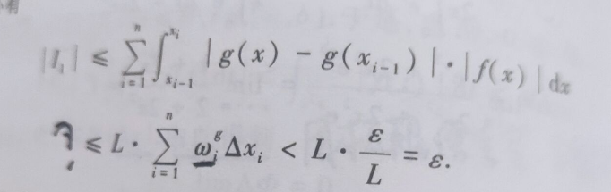

今天干了什么事儿？

# 目录
- 上课
- 反思

## 正文
- 上课
	- 大雾开始讲知识点了，但也开始疯狂塞东西（语录“你别不知道我在说什么”），不过讲的确实有点意思吧
	- 军理迟迟没法回答问题，唉，我是当代文盲典型了
	- 英语，唉，主要是注意提问，但好像也没啥，又不计入平时分，但我确实没什么兴趣听
	- 淑芬讲到第二中值定理，我自己看过程都卡在那个I1的放缩上，感觉怪异
	- 解读英语，水的一逼，感觉就是变相的英语兴趣班。
- 反思
	- 坐姿问题，严重驼背，这才是昨晚累的相似的主要原因，看相关视频评论的观点是背部肌群没怎么锻炼自然会驼背，好的解决办法就是平时多注意，少前倾，唉唉
	- 握笔姿势又忘了捏麻痹。