> 参考书籍：Python Crash Cource by Eric Matthes 译者 袁国忠 人民邮电出版社
> 笔记软件：obsidian
> 作者：Yuki

## 封面图
- 
## 第二章——变量和简单数据类型
卧槽，太酷了
>*Python 中语句结束不需要以分号结束，变量不需要提前定义。*
- **语法突出**：python解释器会使用不同的颜色突出代码的不同部分，函数，字符串，文字符号等等的颜色会有所区别。
- ==注释方式==：
	- `#`-井号注释，单行注释
	- 使用三个单引号（`'''`）或三个双引号（`"""`）括起来，可以进行多行注释。
- 详细说一下print的参数：
	- Python 的 `print()` 函数可以接受多个参数，用于输出信息到控制台。以下是 `print()` 函数的一些常用参数：
		1. **位置参数**：你可以传递任意数量的位置参数，这些参数将按照顺序被打印出来。默认情况下，它们之间以**空格**分隔。
		
		   ```python
		   print("Hello", "World", "!")
		   ```
		
		2. **分隔符（`sep`）**：你可以使用 `sep` 参数来指定参数之间的分隔符，默认是空格。
		
		   ```python
		   print("Hello", "World", "!", sep="-")
		   ```
		
		3. **结束符（`end`）**：`end` 参数用来指定每次调用 `print()` 后光标的结束位置，默认是换行符 `\n`。
		
		   ```python
		   print("Hello, World!", end=" ")
		   print("Welcome to Python!")
		   ```
		
		4. **流（`file`）**：`file` 参数允许你指定输出到哪个流，默认是 `sys.stdout`（标准输出）。
		
		   ```python
		   print("Hello, World!", file=open('output.txt', 'w'))
		   ```
		
		5. **布尔标志（`flush`）**：`flush` 参数用来控制是否在每次调用 `print()` 后刷新输出缓冲区，默认是 `False`。
		
		   ```python
		   print("Hello, World!", flush=True)
		   ```
		
		6. **宽度（`width`）**：`width` 参数用来指定输出的宽度，默认是控制台的宽度。
		
		   ```python
		   print("Hello", width=10)
		   ```
		
		7. **精度（`precision`）**：对于浮点数，`precision` 参数用来指定小数点后的位数。
		
		   ```python
		   print("Pi is approximately:", 3.14159, precision=2)
		   ```
		
		8. **格式化（`formatter`）**：`formatter` 参数允许你指定自定义的格式化函数。
		
		   ```python
		   def my_formatter(x, y):
		       return f"{x}, {y}"
		
		   print("Hello", "World", formatter=my_formatter)
		   ```
		
		- 请注意，`precision` 和 `formatter` 参数在 Python 3 中已经被废弃，因为它们在 Python 3.1 中被移除。对于格式化输出，推荐使用 `format()` 函数或 f-strings。
		- 这些参数使得 `print()` 函数非常灵活，可以用于各种不同的输出需求。
		- 看不懂也没关系，学到后边就看懂了。
		- 还有个字符串格式化输出
		- `print(f"")` 这种用法在Python中是使用格式化字符串的`print`函数调用。`f`前缀表示该字符串是格式化字符串字面值（通常称为f-string），它允许你在字符串中直接嵌入表达式。
			- f-string是Python 3.6及以后版本引入的一种新的字符串格式化机制。其基本语法是在字符串前加上字母`f`，然后在花括号`{}`中放入变量或表达式。这些变量和表达式在字符串被创建时立即求值，并被格式化为字符串。
			
			- 下面是一些使用f-string的例子：
			
			```python
			name = "Kimi"
			age = 1
			
			# 简单使用f-string
			print(f"Hello, my name is {name}.")
			
			# 在f-string中使用表达式
			print(f"{name} is {age} year old.")
			
			# 使用函数
			length = len("Hello, World!")
			print(f"The length of 'Hello, World!' is {length}.")
			
			# 调用属性或方法
			print(f"The first letter of your name is {name[0].upper()}.")
			```
			
			- 输出将是：
			
			```
			Hello, my name is Kimi.
			Kimi is 1 year old.
			The length of 'Hello, World!' is 13.
			The first letter of your name is K.
			```
			
			- 请注意，f-string中的表达式是惰性求值的，这意味着它们在运行时才被计算。这使得f-string非常适合于格式化输出，并且它们提供了一种非常直观和易读的方式来构建包含变量的字符串。

- 变量（variable）的特性：始终记录最新存储的数据信息
	- 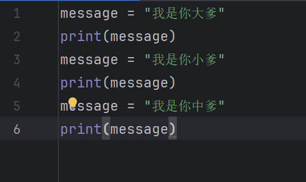
	- 还有，可以每个给变量赋值的语句都单独一行，也可以在同一行里同时赋值多个变量，用逗号隔开就行
		- 比如variable_1， variable_2 = 'kkk', 'mfd'
- 注意变量的命名
	- 变量名只能包含字母、数字和下划线。变量名可以字母或下划线打头，但不能以数字打
	头，例如，可将变量命名为message_1，但不能将其命名为1_message。
	- 变量名不能包含空格,但可使用下划线来分隔其中的单词。例如,变量名greeting message
	可行，但变量名greeting message会引发错误。
	- 不要将Python关键字和函数名用作变量名，即不要使用Python保留用于特殊用途的单词
	- 慎用I,O
	- 少用大写
- 字符串（string）
	- 用成对的单或者双引号包含着的字符符号，例如’nmsl‘，’“nmsl”‘，“’nmsl‘”，“nmsl”，这四种。
	- 关于输出英文的大小写转换==**方法**==（我觉得就叫函数233，但好像这俩不一样。）
		- 首先，在print函数参数表括号里，print（message.方法（））,其中的”.方法“用来执行这个方法的指令，完成一些自动的工作。
		- title()：是用来将一段·字符串中的一句话（不含逗号的文本）中的首字母变为大写，而其余变为小写。
		- upper()：将字符串中所有英文字母都变为大写
		- lower()：同理，全变为小写
		- 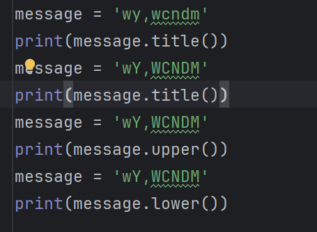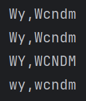
	- 其次是**拼接**：
		- 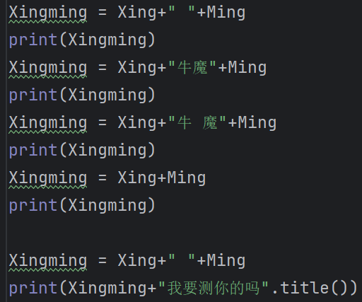
		- 格式呢就像上图那样，实质是变量和字符串用+链接起来，结果还是一个字符串，像Xingming = Xing+"牛魔"+Ming，就是Xing，Ming和”牛魔“这个字符串用+来拼接，Xingming变量就用来存储这个拼接后的结果，当然也可以把这个拼接直接放print里。
	- 实用の换行符与制表符：
		- 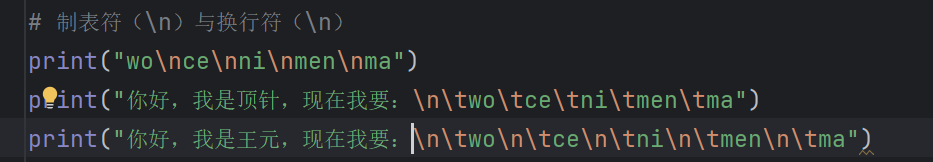
	- 方法-删除空白
	- 删除末尾的空白rstrip（），那么删开头就是lstrip（），同时删除开头和结尾指定字符的就是strip（）
	- 注意：
		- strip（）一类的方法作为一种删除字符的方法，其后边的（）内可以加上指定的字符串从而删除，==如果没有就是默认删除空白字符（包括空格，制表符，换行符）==
		- 而rstrip和lstrip的区别在于从末尾字符和首字符开始识别与删除，相同点都是直到遇到未指定字符（比如指定字符没设定那就是除空白字符以外的所有字符）时才会停止删除，否则将连续执行。
		- 例子：“        我说那个xx啊，我们洗澡的时候你又在偷看吧！        ”
			- 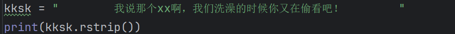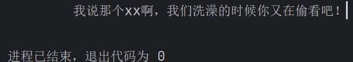
	- 关于字符串书写注意
		- 单双引号要合理使用
		- 以下为错误示例
			- ‘ 恁干咩 ‘ 啊 ’ 
			- “ 老林啊啊 ” 啊 “
			- ‘ 衣裤 ” 衣裤啊~ “
- 数
	- 整数运算
		- 四则运算符号+，-，，\//\(注意是左斜杠)
		- 乘方运算**
			- 11\*\*\*\4
			- 记得要print出来，不然没用
		- 取余——%
		- 可以用（）改变运算次序
	- 浮点数：带小数点的数字，简单理解
		- 浮点数的严格定义通常遵循IEEE 754标准，这是一个国际标准，规定了浮点数的存储、表示和运算方式。以下是根据IEEE 754标准的浮点数严格定义：
			
			1. **符号位（Sign Bit）**：浮点数的第一位用于表示数值的符号，0通常表示正数，1表示负数。
			
			2. **指数部分（Exponent）**：紧接着符号位的是指数部分，它使用二进制表示，并且采用偏移（Bias）的方式进行编码。偏移值取决于浮点数的精度，例如：
			   - 对于单精度（32位）浮点数，指数部分有8位，偏移值是127（\(2^7 - 1\)）。
			   - 对于双精度（64位）浮点数，指数部分有11位，偏移值是1023（\(2^{10} - 1\)）。
			
			3. **尾数部分（Mantissa or Fraction）**：指数部分之后是尾数部分，它表示数值的有效数字。尾数通常以隐含的1（对于规格化数）或隐含的0（对于非规格化数和零）开始，具体取决于数值的表示方式。
			
			4. **规格化数（Normalized Numbers）**：规格化数是指尾数部分以1开始的数，小数点之后的部分存储在尾数中。例如，数值1.0在规格化表示中，尾数部分是0，指数部分是偏移值。
			
			5. **非规格化数（Denormalized Numbers）**：非规格化数是指尾数部分以0开始的数，用于表示非常接近于0的数值。这种表示方式允许浮点数表示小于规格化数最小值的数。
			
			6. **特殊值**：
			   - **无穷大（Infinity）**：当指数部分为全1，尾数部分为全0时，表示无穷大。符号位决定正无穷或负无穷。
			   - **NaN（Not a Number）**：当指数部分为全1，尾数部分不全为0时，表示不是一个数字。NaN用于表示无效的数学运算结果，如0除以0。
			
			7. **偏移量（Exponent Bias）**：指数部分的实际值需要减去偏移量以获得其真实值。例如，如果一个单精度浮点数的指数部分为200，那么它的实际指数值为200 - 127 = 73。
			
			8. **数值表示**：浮点数的数值可以通过以下公式计算：
			   \[ (-1)^{s} \times (1 + m) \times 2^{(e - b)} \]
			   其中：
			   - \( s \) 是符号位。
			   - \( m \) 是尾数部分的二进制小数，不包括隐含的1。
			   - \( e \) 是指数部分的值。
			   - \( b \) 是偏移量。
			
			9. **精度和舍入**：由于尾数部分的位数有限，浮点数的精度也是有限的。在进行浮点数运算时，可能会发生舍入误差，即数值会被四舍五入到最接近的可表示值。
			
			10. **存储格式**：浮点数的存储格式取决于其精度，常见的有单精度（32位）和双精度（64位）。
			
			IEEE 754标准确保了不同计算机系统和编程语言之间浮点数的一致性和互操作性。
		- 然后呢有个神秘数字——0.3
			- 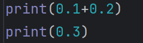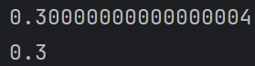
	- 字符串类型转换函数——str()
		- 用于将非字符串值转换为字符串
		- 例如：str(114514)就把数值114514转换成字符串”1145114“
	- 关于py2中的整数除法
		- print（3/2）会打印出1，后面的小数直接被删除。
		- print（3.0/2）会打印出1.5，正常的浮点数形式结果。
- 神秘命令——==import this==，自动打印名言
	- 
	- The Zen of Python, by Tim Peters
		Beautiful is better than ugly.
		Explicit is better than implicit.
		Simple is better than complex.
		Complex is better than complicated.
		Flat is better than nested.
		Sparse is better than dense.
		Readability counts.
		Special cases aren't special enough to break the rules.
		Although practicality beats purity.
		Errors should never pass silently.
		Unless explicitly silenced.
		In the face of ambiguity, refuse the temptation to guess.
		There should be one-- and preferably only one --obvious way to do it.
		Although that way may not be obvious at first unless you're Dutch.
		Now is better than never.
		Although never is often better than *right* now.
		If the implementation is hard to explain, it's a bad idea.
		If the implementation is easy to explain, it may be a good idea.
		Namespaces are one honking great idea -- let's do more of those!
		- 美丽胜过丑陋。
		- 显式比隐式好。
		- 简单比复杂好。
		- 复杂比复杂好。
		- 平坦比嵌套好。
		- 稀疏总比密集好。
		- 可读性很重要。
		- 特殊情况不足以破坏规则。
		- 尽管实用胜过纯洁。
		- 错误永远不会悄无声息地过去。
		- 除非明确地让他闭嘴。
		- 面对模棱两可的情况，拒绝猜测的诱惑。
		- 应该有一种——最好只有一种——显而易见的方法来做到这一点。
		- 虽然一开始可能看不出来，除非你是荷兰人。
		- 现在总比没有好。
		- 虽然永远不会比现在更好。
		- 如果实现很难解释，那就是个坏主意。
		- 如果实现容易解释，那么它可能是一个好主意。
		- 名称空间是一个非常棒的想法——让我们做更多这样的事情吧！
---

*你可以将余生都用来学习Python和编程的纷繁难懂之处,但这样你什么项目都完不成。不要**企图编写完美无缺的代码;** 先编写行之有效的代码,再决定是对其做进一步改进,还是转而去编写新代码。*

---
## 第三章——列表
- Anyway，列表是一种用于存储一系列的元素（数值，字符串，字母）的，非常灵活的，==数据结构==。
	- 用方括号(\[])来表示列表,并用逗号来分隔其中的元素。
	- 例子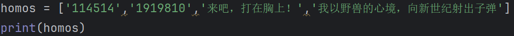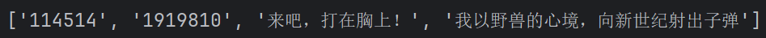
- 访问列表元素
	- 首先，列表中每一个元素有一个自己的“索引”
	- 而列表内由左到右的元素的索引事从0开始的
	- 在上面的例子中，print（homos\*\[0]）就打印出114514这个数值
	- 特殊的，如果要访问最后一个元素，可以用-1，即print(homos\[-1])
	- 以此类推，-2就是倒数第二个元素的索引，==在列表长度未知时很好用==
- 修改列表元素
	- 直接用赋值符就行。
	- 可以在不同类型的元素间转换
		- 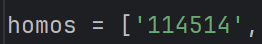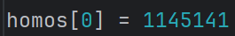
		- 比如把字符串改为数值
		- 不过一般不这么换吧，都是相同类型的转换。
- 添加列表元素
	- 用append（）方法就可以把新元素加到列表的末端
	- 注意，append方法只能加到尾端，参数表是固定的
- **在程序交互设计中，可以先创建空列表，再经由用户输入元素后存入列表中**
- 补充1：查找列表元素：
	- 使用index（）方法，输入一个值，如列表中有则返回对应索引，否则返回ValueError
	- 如果列表有重复的元素，则使用index查询它时会返回第一次出现的索引（从0开始）
- 补充2：列表简单合并与自我扩增：
	- 合并：使用加号（+）连接即可
	- 扩增：直接在列表上使用* 一个整数，就表示将列表内元素复制整数份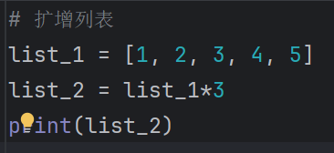结果会是按原来的顺序增加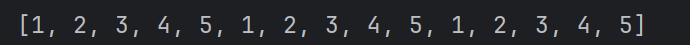
	- 
- 插入列表元素
	- 方法——insert（）
	- 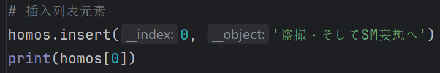
	- 可以控制想要插入的位置和内容，具体插入原理请看[[insert方法示意图.canvas|insert方法示意图]]
- 删除列表元素
	- 一，del（不是方法，也不是函数）
		- 例子
			- 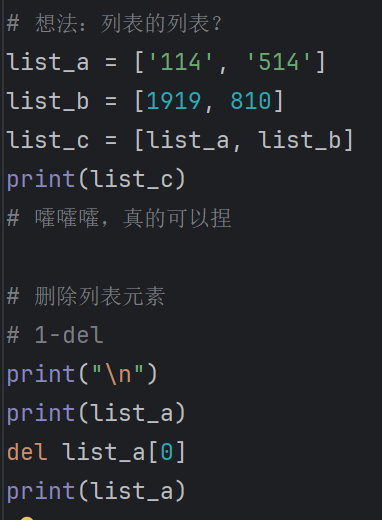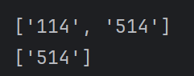
	- 二，pop（方法）
		- 首先科普一下栈（Stack）
			- 非人话：
				栈（Stack）是一种遵循后进先出（Last In First Out，LIFO）原则的数据结构。在栈中，元素的添加和删除都发生在同一个位置，这个位置被称为栈顶（Top）。以下是栈的一些基本特点：
				
				1. **后进先出（LIFO）**：最后添加到栈中的元素将是第一个被移除的元素。
				
				2. **栈顶操作**：所有操作（添加和删除）都在栈顶进行。
				
				3. **主要操作**：
				   - **Push**：向栈顶添加一个元素，使其成为新的栈顶元素。
				   - **Pop**：移除栈顶元素，并返回它。如果栈为空，则可能抛出错误或返回特定的值。
				   - **Peek/Top**：查看栈顶元素，但不移除它。
				   - **IsEmpty**：检查栈是否为空。
				
				4. **容量**：有些栈实现有固定容量，称为静态栈；而有些栈可以动态增长，称为动态栈。
				
				5. **应用场景**：栈在计算机科学中有着广泛的应用，例如：
				   - 函数调用的执行上下文管理（调用栈）。
				   - 表达式求值和运算符优先级处理。
				   - 回溯算法，如迷宫求解、八皇后问题等。
				   - 撤销操作的实现（Undo功能）。
				
				6. **实现方式**：栈可以用数组或链表来实现。数组实现的栈具有固定大小，而链表实现的栈可以动态调整大小。
				
				7. **时间复杂度**：栈的基本操作（Push、Pop、Peek）通常具有O(1)的时间复杂度，即常数时间内完成。
				
				8. **空间复杂度**：栈的空间复杂度取决于栈中元素的数量，通常为O(n)，其中n是栈中元素的数量。
				
				栈是一种非常基础且重要的数据结构，它在编程语言的实现、编译器设计、算法开发等领域都有重要的作用。
			- 人话：
				好的，我们可以把栈想象成一个简单的盘子堆叠系统，就像你在餐厅里看到的那样，服务员把用过的盘子堆在一边，然后按顺序取走它们。
				1. **后进先出（LIFO）**：就像服务员最后放上去的盘子是第一个被取走的，栈也是这样工作的。你最后放进去的东西，会是第一个被拿出来的。
				
				2. **只有一个操作点**：所有的操作都发生在这个盘子堆的最上面，也就是栈顶。你不能从中间或者底部直接取盘子。
				
				3. **基本动作**：
				   - **Push（推入）**：就像把一个新盘子放在盘子堆的顶部。
				   - **Pop（弹出）**：把最上面的盘子取走，就像服务员取走最上面的盘子。
				   - **Peek/Top（查看顶部）**：看看最上面的盘子是什么，但不取走它。
				   - **IsEmpty（检查是否为空）**：检查一下盘子堆是不是空的，也就是有没有盘子。
				
				4. **容量限制**：有些盘子堆有固定数量的盘子，用完了就不能再加了，这就是静态栈。有些盘子堆可以根据需要增加盘子，这就是动态栈。
				
				5. **实际应用**：栈在计算机编程中有很多用途，比如：
				   - 管理程序中函数的调用顺序。
				   - 计算数学表达式的值。
				   - 解决一些需要尝试多种可能性的问题，比如走迷宫。
				
				6. **如何实现**：可以用一排排的盘子（数组）或者一个接一个的盘子（链表）来实现栈。
				
				7. **操作速度**：在栈上进行Push、Pop或Peek操作通常非常快，几乎是瞬间完成的。
				
				8. **占用空间**：栈占用的空间取决于有多少盘子在堆里，也就是栈中有多少元素。
				
				简单来说，栈就像是一个只能从顶部操作的盘子堆，你总是先看到最后放上去的盘子。
		- ==**方法pop()可删除列表末尾的元素,并让你能够接着使用它。术语弹出(pop)源自这样的类**==
		 ==**比:列表就像一个栈,而删除列表末尾的元素相当于弹出栈顶元素。**==
		- 然后呢是例子
			- 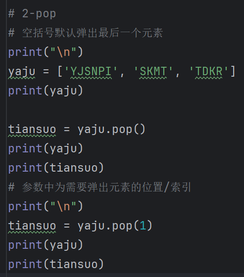
	- 三，remove（方法）——根据值删除，就是直接指明要删除的元素
		- 例子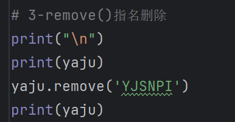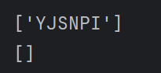
		- 特性:可以用变量存储需要删除的值，然后直接将变量作为remove的参数，实现pop的“弹出”效果
			- 例子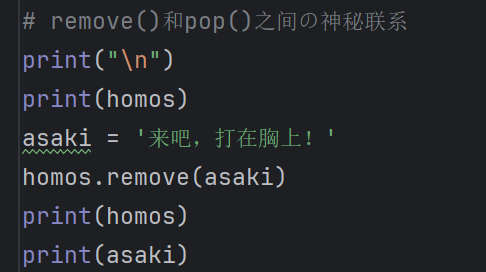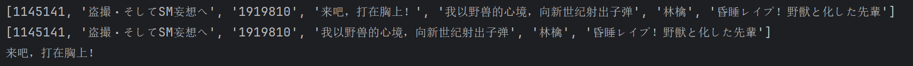
			- ==如果想全部删除相同的值，那么得用循环+判断语句搞定==
		- 
- 组织/整理/排序列表
	- 对于字母类排序
		- 永久排序sort（）方法
			- 不可更改
			- 默认按照首字母重排序
			- 例子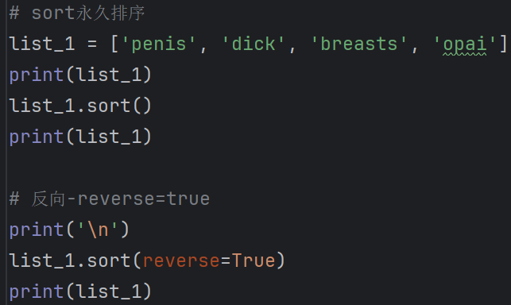
			- 注意True要首字母大写
		- 临时排序sorted（）函数
			- 例子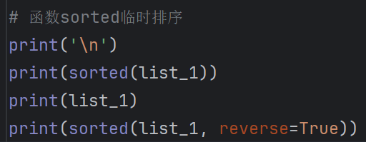
			- 默认会按照首字母的顺序重排序
			- 也可以反着字母顺序来
	- 根据列表元素的索引位置反转
		- 方法reverse（）（永久性的）
		- 例子，唉又不需要输入实参，知道就行了
- 求列表的长度（元素个数）
	- 用len函数即可
	- 哦对了，这个函数是返回数值的，要么用变量存一下，要么print打印出来，别就写个函数就完了啥也不处理。
- ==注意列表长度，别超范围==，可以用len把长度求出来后再做操作
	- 铸币操作就不做了，遇到了再说

---

## 第四章——操作列表
- 突然发现这本书不像其他的编程书把知识专题化，而是结合到一起来讲。
- 首先是for循环，
	- 例子引入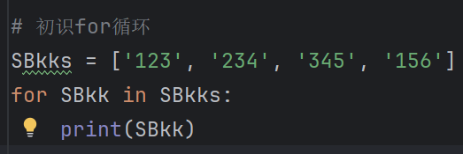
		- for SBkk in SBkks：意思是从SBkks这个列表中取出第一个元素存入新创建的变量SBkk中
		- 然后print打印出来，然后又回到for语句中再取一次再打印出来，重复操作直至取出列表中最后一个元素并打印，就停止了，跟c语言中的不一样，条件是隐性的，没明着说是“取值的次数与列表长度有关”，而且注意print语句和临时变量也可以无关，可以相互独立的
		- 然后捏这个临时创建的变量名称是可以随便取的，这种==单复数格式的取名==是一种便于某些场景使用的规则。比如在cats【】列表就用cat变量存。
- ==Python根据缩进来判断代码行与前一个代码行的关系。==
	- for语句后紧跟其对应的代码块，而当我们说某一个代码块时其实是在说“缩进”的范围
		- 比如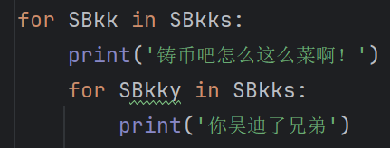
		- 我们说一个缩进以上的是一个代码块，两个缩进以上的又是一个代码块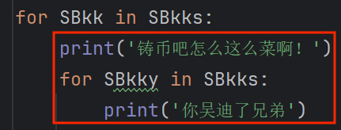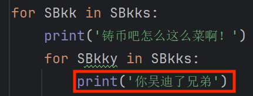
- 创建数值列表——range（）函数
	- 一种内置函数，用于生成数字序列。可以生成一个起始值、结束值和一个步长值指定的序列。
	- range函数特性
		- 首先参数表长这样——range(start, stop, step)
		- 其中start是起始值，表示生成的第一个数字
		- stop终止值，在到达这个值时就会停止生成
		- step是步长，从起始值开始生成数字时从一个数字到下一个数字所跨越的间隔或距离。
		- ==如果只写个range（114），那么这里的114是指stop值，而start值默认为0，step值默认为1，这点要记住==
	- for循环与range函数的使用如——for s in range（a,b,c）
		- for循环的次数取决于\*\[(b-a)/c](取整)
		- 比如range（1，4），step默认为1，那么就只执行3次
	- 例子：输出一个元素为1到10每个数的平方的数值列表
		- 思路：
			- 先把空列表创建好
			- 然后用for+range语句实现
				1. 生成1-10的数字
				2. 然后将数字乘方
				3. 最后将数字存储到前面的列表中
			- 最后打印这个数值列表即可
			- 改良一下就是2+3结合把乘方的结果直接加到列表里而不是通过临时变量交接
- 简易的==简单统计计算函数==
	- 最大值——max（）
	- 最小值——min（）
	- 求和——sum（）
	- 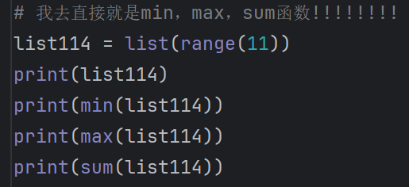
- ==列表解析==？快速创建数值列表！
	- 列表解析将for循环和创建新元素的代码合并成一行,并自动附加新元素。
	- 基本格式：\*\[`expression for item in iterable if condition`]
	- `expression`：对每个元素进行的操作或计算。
	- `item`：从 `iterable` 中迭代出的元素。
	- `iterable`：一个可迭代对象，如列表、元组、集合等。
	- `condition`（可选）：一个布尔表达式，用于过滤 `iterable` 中的元素。
	- 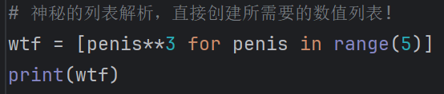
		- 表达式：把牛至做三次方运算
		- 牛至是元素
		- range函数，生成数字的
		- 没有condition
- 使用列表
	- **切片**，就是字面意思上的把一个列表的一部分切出来
		- 方法是列表名+\*\[起始值 : 终止值]
		- 起始值和终止值如果不填就是默认的列表的起始值和终止值
		- 小技巧：利用上面的特性可以巧妙切出任意位置的切片
			- 例1：list\*\[  : 5 ]——切出第一到四的元素
			- 例2：list\*\[ -4 :  ]——切出倒数第四个元素及其之后的元素
			- 。。。。。。还有很多
	- 遍历切片：说白了就是for循环语句中在列表后边加上\*\[起始值 : 终止值]就可以只遍历切片了
		- 例：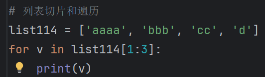
	- 复制列表：
		- 实际上目前就是用切片来“复制”列表（的内容）
		- 只需要把起始值和终止值都不写，然后赋值给一个新变量就行了
		- 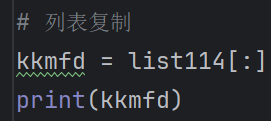
		- 示例如上
- 补充print（）函数的”end=“参数
	- 一般而言直接输出print内的内容时默认会在末尾加上一个换行符使得下一次print打印内容时会在程序的下一行执行
	- 但是也可以手动替换末尾的换行符，比如print（”我岑你们吗“，end=” “）
	- 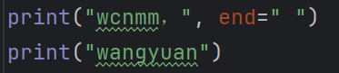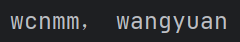
	- 就可以在同一行里输出两个print的结果
	- end=可以把换行符替换成很多东西，也可以不加。
	- 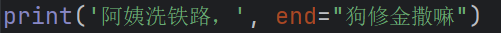
- **元组（Tuple）**：Python将不能修改的值称为不可变的,而不可变的列表被称为元组。
	- 用圆括号来标识，但也可以不用
	- 创建元组：
		- 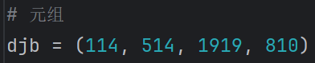
	- 访问：
	- 遍历
	- 修改元素：
		- 直接修改元素的值是不行的，但是可以直接给存储元组的变量重新赋一个新的元组
		- 这样就能修改元组了（
		- 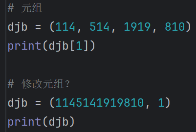
- 代码格式？参考PEP 8即可
- ==回过头来谈谈”切片“操作==：
	- 它还可以对存储其他类型的变量使用
	- 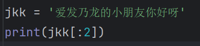输出
	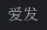
	- 是吧

---

## 第五章——if语句
- 条件测试/布尔表达式
	- if后边跟上的语句是叫“条件测试”的表达式
	- 在条件测试中要注意大小写，当然也可以用lower（）等方法来临时改变大小写。
	- 省略若干熟悉内容
	- 多个条件——and和or，当然我懂。
	- ==且-and，或-or，非-not==
	- 补充：
		- 在Python中，`if not`语句是一种使用逻辑非运算符`not`的控制流语句。`not`运算符用来反转布尔值，即如果它的操作数为`True`，则结果为`False`；如果操作数为`False`，则结果为`True`。
		
		- 使用`if not`语句可以方便地检查一个条件是否为假（False）。下面是一些使用`if not`语句的例子：
			- 例子 1：基本使用
			
			```python
			x = 0
			
			if not x:
			    print("x is False or zero")
			```
			
			这段代码会检查变量`x`是否为假（在Python中，`0`被视为`False`）。如果`x`为`0`或任何被视为假的值（如`None`、`False`、空字符串`""`、空列表`[]`、空字典`{}`等），则执行`if`块内的代码。
			
			- 例子 2：结合其他逻辑运算符
			
			```python
			x = 5
			y = 10
			
			if not (x < y and y > 0):
			    print("The condition is False")
			else:
			    print("The condition is True")
			```
			
			- 这里，`if not`语句检查括号内的复合条件是否为假。如果`x < y`和`y > 0`都为真，则整个条件为真，`if not`语句将执行`else`块；如果至少有一个条件为假，`if not`语句将执行`if`块。
			
			- 例子 3：检查变量是否未定义
			
			```python
			x = None
			
			if not x:
			    print("x is None or False")
			```
			
			- 在这个例子中，因为`x`是`None`，它被视为假，所以`if not x`为真，会执行`if`块内的代码。
			
			- 例子 4：检查列表是否为空
			
			```python
			my_list = []
			
			if not my_list:
			    print("The list is empty")
			```
			
			- 这里，空列表`[]`被视为假，所以`if not my_list`为真，会打印出列表为空的信息。
	- ==检查特定值是否在列表中，一种条件测试的表达式==（常用的工具）
		- 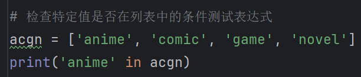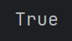
		- 符合就返回True，否则False
	- ok，条件测试表达式就是布尔表达式的别称。（bool）
- 语句类型
	- 单if
	- if-else——简单分支
	- if-elif-elif。。。多分枝
	- if-else-elif-else-elif....混合多分枝
	- **注意：if-if-。。。-if-else语句中，else之与最接近它的if相关，也就是最后一个if。**
	- 总之合理选择
- 实际使用
	- 检查特殊元素，for循环里加个if判断
	- 检查列表是否为空
		- 这里列表的有无内容分别表示false和true两个布尔结果
		- 当然，变量的数值，比如1/0也可以作为布尔表达式，分别返回true和false
	- 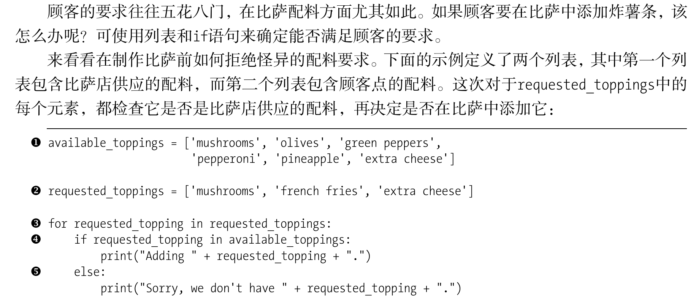
		- 这是书中的一个例子，使用多个列表区分顾客点的配料表和pizza店支持的配料表，使用for循环和if判断嵌套，可以判断顾客点的配料是否在支持的配料表中，有效地避免出现漏洞

---

## 第六章——字典
- 字典（dictionary）：一种用于存储键值对（key-value pairs）的内置数据结构，字典中的每个元素都是一个键值对，其中键（key）是唯一的，而值（value）可以是任何数据类型。
- ==键的类型==：
	- 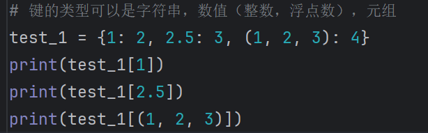哦对还可以是列表，字典（嵌套了）
- 值的类型：同上
- 在Python中,字典用放在花括号{}中的一系列键—值对表示
	- 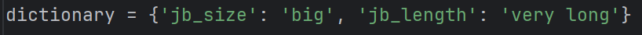
- ==小常识：屏幕坐标系的原点通常为左上角==
- 访问键值对：**字典名\*\[ '键名字' ]** 就可以提取键的值了
	- 比如print（字典名\*\[ '键名字' ] ）就可以打印值
- 添加键值对：
	- 方法：字典名\*\[ '键名字' ] = 值内容
	- 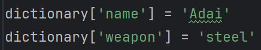这样子
- 删除键值对：
	- del 字典名\*\[ '键名字' ]  即可
	- 
- 多行定义字典：
	- 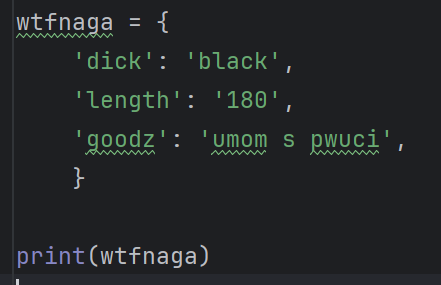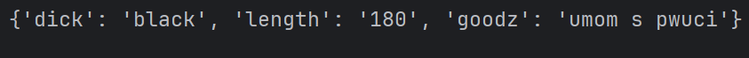
	- 注意逗号别忘了
- 在练习6-3时
	- 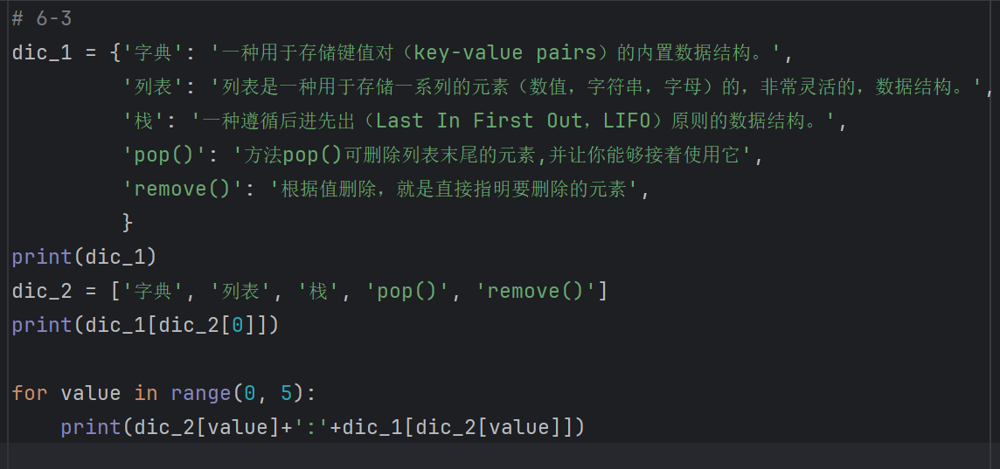
	- 有一个发现就是**字典中的键的名字可以由列表取值得到**
	- 也就是可以比较方便的做for循环
	- 但是不如下边的方法方便
- 遍历字典（键值对）
	- 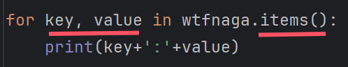
	- 这里要注意的是，要有两个变量来存储字典的键值对，items（）方法通常和字典一起用，作用是每次取出字典中的一个键值对==元组==并返回给两个变量（注意顺序，左边key是键，右边value是对应的值，和变量名字无关）
		- 为什么要强调是元组？假如我们只用一个变量存储这个items（）返回的东西并尝试修改它
		- 就会出现报错，说明啥，返回的东西是元组（tuple），不是列表！
	- 还有，遍历顺序是顺序（也就是插入键值对的顺序），这是在3.7版本及以上的特性：“保留插入顺序”（insertion order preservation）。3.6及以下版本就是无序的。
	- 解释一下items（）方法：
		- 在Python中，`items()` 方法通常与字典（dictionary）相关。字典是Python中的一种数据结构，用于存储键值对（key-value pairs）。`items()` 方法用于返回一个包含字典中所有（键，值）对的视图对象。
- 遍历字典（键keys（））
	- 跟上边的差别就是，你可以只用一个变量，然后不用items（）方法。
	- 直接写：
		- 
		- 那么就会==默认==返回键给这个变量
	- 当然，你可以显式地给字典后边加上方法keys（），这样比较好文明
	- 对于字典名.key()
		- 然后，当你单独打印字典.key()时，结果是包含所有键的一个列表
		- 这里就可以和上边的6-3联系起来，就是另一种遍历字典的方式了
		- 既然是列表，那么也就可以用if语句判断某个键是否在字典中。
		- 既然是列表，那么我们也可以用函数sorted（）来排个序。
- 遍历字典（值values（））
	- 同上，用values（）方法返回的也是一个列表
	- 但是经常会碰到取出来的值可能有重复的，这时候可以用set（）函数来给values取出来的值的列表创建一个**集合**，这样遍历取出来的值就不重复了
		- set（）：
			- 在Python中，`set()` 函数用于创建一个新的集合（set）。集合是一个无序的、不包含重复元素的数据结构。
			-  **创建集合**：使用 `set()` 可以创建一个空集合，或者从任何可迭代对象（如列表、元组、字典的键或值等）创建一个集合。
			- **去重**：集合自动去除其中的重复元素，因此它常用于去重操作。
			-  **集合操作**：集合支持数学上的集合操作，如并集、交集、差集和对称差集。（符号分别是 | ， & ，  - ，\^\,）
			-  **不可变元素**：集合中的元素必须是不可变类型，如整数、浮点数、字符串、元组（只要元组本身包含的元素也是不可变类型）。
- 嵌套
	- 本质上是存储不同东西的**变量**之间的互相嵌套
	- 在这里的话，一般是用列表存储大量字典，这也是更普遍的做法
		- 比如网站用户什么的
	- 还有时候是字典套列表，嗯，就是有时候一个键要对应多个值的时候就把值设定为一个列表，方便一些。

---

## 第七章——用户输入与while循环
- input()函数，用于接收与存储传递用户输入的文本
	- 在用户输入过程中，输入回车之前的内容将会被存入input中，这时可以用一个变量来存储这个函数传递的内容。
	- （）内可以输入字符串来提示用户需要输入的文本等
	- 当然input所返回的数据是字符串，输入数值也会变成字符串的。
- 但如果想要获取数值呢？那就用int（）函数来转换
	- 把内容为整数的字符串转换为数值整数
	- 把浮点数做取整处理
	- 复数取整：
	- 其他进制的数转换为十进制整数：
	- 但是不能把内容为浮点数的字符串转换成整数：
		- 但是可以用float（）来转换
- 求模运算符：%
- 一些常用运算赋值符号：+=，-=，\*\=，/=，%=
- while循环来啦：
	- 和if一样的格式，不过作用是“符合条件就进行，不符合就循环停止”
	- 一个例子：
	- 这里的格式挺常用的，**在进入while循环前先定义空字符串的变量**。
- ==使用标志==：就是说只用一个东西代表条件是否满足
	- 这个手段在碰到有大量条件判断时可以进行简化，使代码可读性增加。
- break退出while循环：
	- 就是把break嵌套进if判断里，实际上和while判断是差不太多的，不过，这样可以增加判断的条件数量
	- 常见的一种写法是这种while True然后加个if break
- continue忽略剩余循环语句进入下一轮循环：
	- 正如所说的那样。
	- 例子
- 补充第三章内容：转移列表元素
	- 当然当然，直接复制列表也一样，最后反转了一下，其实一般不用反转，这表示一种特定顺序

---

## 第八章——函数
- 函数定义：
	- 有时候会冒出来一些神必PEP 8提示，唉
	- 当然可以传递参数进去
	- 形参：定义函数时，括号内的参数
	- 实参：调用函数时，括号内输入的参数
	- 实参会存储在形参变量中
	- 注意：==这些参数本质上就是个变量，用来存东西和交换东西的。==
- 函数参数的传递方式
	- 位置实参：说白了就是，形参什么顺序，实参就照着这个顺序输入就行
		- 注意：这个是一直都有的特性，无论什么默认值也好关键字也好，实参的位置都得输对
	- 关键字实参：说白了就是明确地写出形参对应的值
		- 比如（注意形实参都要小写，不然pep8又来恶心里了）
		- 这样就是明确写出名称-值，像是键值对
	- 设置默认值：就是在设置形参的时候就直接把对应的值写好，那么当我们输入实参时不输入那个提前定义默认值的形参的时候，函数内会自动按照默认值来工作
		- 比如这样这个时候也可以去输入值去修改它，结果也会不一样
	- 哦对了，设置了默认值的形参称为默认形参，**紧跟在它之后的形参也必须是默认形参**，否则会报错
- 返回值（return）
	- 函数内部可以用return将处理后的数据传递出来，调用函数时可以用变量存储这个返回值
- 可选择的实参：操作就是把那个可有可无的形参设置默认值为“”这样的空字符串，然后记住把它的位置放在非默认形参的后边
	- 别忘了有可选实参的情况下对函数内作if判断处理
- 返回字典
	- 本质就是返回一个变量所存储的东西，下边讲的传递列表也是一个意思
- 然后传递列表，说白了就是函数具有处理列表的功能，然后呢传递的实参是一个列表，就这样，你用**关键字实参**的方式也是可以的
- 然后是如果你不想传入原本的列表（可能这个函数会直接更改列表内容），你可以传入这个列表的切片，比如list\*\[ : ]作为实参，就可以不更改list里边的内容了
- 传递任意数量的实参：
	- 像这样
	- 用*\作前缀的形参的作用是，让python对相应的实参创建一个元组，并把输入的实参全部作为这个元组的元素
	- 这样的话，搭配for循环比较实用
- 位置实参和任意数量实参的混合使用：
	- 需要把任意数量行参放在最后边，按照位置输入对应的位置实参/关键字实参后再输入任意数量实参，这样才不报错
- 任意数量的**关键字实参**？或许用于字典的键值对的存储吧
	- 比如这个例子
	- 这里呢，两个**\就表示这个形参会让python创建一个空字典，对应输入的实参就是键值对，也就是所谓的关键字实参
	- 注意，输入关键字实参时仍然按照变量赋值的格式去写不然会出错
- **把函数导入到模块（module）中**：
	- 模块定义：*Python的模块可以理解为一种封装好的代码包，它包含了函数、类和变量等，用于实现一些特定的功能。模块可以被其他Python代码重用，以避免重复编写相同的代码。*
	- 用法：直接举个例子
		- 首先在同一个文件夹中新建一个py文件
		- 然后在新的py中写好函数
		- 然后在原来的代码中调用记得要import所需要的py文件，调用函数的时候也要先写已经import的py文件名字然后写“.”加上函数名字，别忘了写点，这算是把函数当作一种方法来使用了
		- 结果
	- ==实质：Python读取这个文件时,代码行import pizza让Python打开文件pizza.py,并将其中的所有函数都复制到这个程序中。你看不到复制的代码,因为这个程序运行时,Python在幕后复制这些代码。==
		- 也就是说python会在import 这个文件后马上就执行一遍这个导入的代码，而此时如果你导入的代码中有一些打印语句比如
			- 那么就会在代码中输出
			- 
		- 所以这就是为什么下边还有导入函数的各种语法，为的就是避免出现不想要的结果。
	- 这就是一种导入方法:只需编写一条import语句并在其中指定模块名,就可在程序中使用该模块中的所有函数。如果你使用这种import语句导入了名为module_name.py的整个模块,就可使用下面的语法来使用其中任何一个函数:
	- module_name.function_name()
- ==导入特定的函数==：
	- 抄都懒得抄了，直接放图
	- 若使用这种语法,调用函数时就无需使用句点。
- 给导入的函数改个“**别名**”：
	- from module_name import function_name ==**as**== another_name
	- as作为一个关键字可以在当前代码文件中更换导入的函数名称
- 给导入的模块也改个名：
	- import module_name as another_name
	- 格式如上
- 导入模块中所有函数：
	- from module_name import \*\
	- 格式如上
	- 但注意这种做法的前提是你知道当前代码中的函数不会和导入的文件中的函数名称重复，==否则会导致当前代码中的函数或者导入的函数被另一个同名函数覆盖掉（根据顺序）==
- 函数编写指南：
	- 给形参指定默认值时,等号两边不要有空格
	- 要命名的参数太长的咋办？
		- 可在函数定义中输入左括号后按回车键,并在下一行按两次Tab键,从而将形参列表和只缩进一层的函数体区分开来。
		- 例：
		- 相邻函数之间空个两行就好

---

- 终于来到第九章，虽然算下来还有三章63页才学完基础知识，但也不多了！

---

## 第九章——类
- 类（class）：
	- 首先介绍下命名法：
		- 大驼峰式命名法（CamelCase）是一种在编程中用于变量、类、函数等命名的约定。这种命名法的特点是在每个单词的首字母大写，除了第一个单词可能会小写。常用于类名
		- 如果第一个单词小写，这种形式被称为“小驼峰式”（lowerCamelCase），常用于变量名、函数名和方法名。
	- 然后是方法和函数的区别：
		- 在Python中，方法和函数在很多方面相似，但它们之间也存在一些关键的区别：
		1. **定义方式**：
		    
		    - 函数：是一个独立的代码块，可以执行特定的任务，它不需要与类或对象相关联。
		    - 方法：是定义在类内部的函数，它与类或对象相关联，可以访问类的属性和其它方法。
		2. **调用方式**：
		    
		    - 函数：直接通过其名称调用。
		    - 方法：通过类的实例（对象）调用，或者使用类名和类实例。
		3. **参数**：
		    
		    - 函数：没有隐含的参数。
		    - 方法：至少有一个隐含的第一个参数，通常命名为`self`（尽管这不是强制的），它代表当前对象的引用。
		4. **作用域**：
		    
		    - 函数：具有全局作用域或局部作用域。
		    - 方法：具有类的作用域，可以访问类属性和其它方法。
		5. **目的**：
		    
		    - 函数：通常用于执行不依赖于对象状态的操作。
		    - 方法：用于操作对象的状态或执行与对象相关的操作。
		6. **继承**：
		    
		    - 函数：不涉及继承。
		    - 方法：可以被继承，子类可以重写父类的方法。
		7. **静态方法和类方法**：
		    
		    - 函数：不直接与类相关联，但可以通过类名调用。
		    - 方法：可以是静态方法（使用`@staticmethod`装饰器）或类方法（使用`@classmethod`装饰器），静态方法不接收隐含的`self`参数，类方法接收类作为第一个参数而不是实例。
	- 类的定义格式：belike
		- 
		- Cat是类的名字，其首字母需要大写，与函数做区分
		- _ \_init\_ _ （这里空格隔开了）是在类中的特殊方法，Python调用这个__init__()方法来创建Dog实例时,将自动传入实参self。
			- 那这个方法/函数究竟拿来干嘛的呢？？
			- 拿来存放和访问属性的。
		- 可通过实例访问的变量称为**属性**。
			- 实例又是个什么🐕把？就是
			- 右边这一坨用参数定义了的东西，完了赋值给Zhao_cai，那么Zhaocai就是这么个实际例子，实例。
			- 哦哦哦属性就是变量，什么变量？当然是self.后边跟着的叫变量，赋值号右边的叫形参，你创建实例的时候得把实参写进去对吧，那么最终也得传递到定义的属性上去对吧。
				- 那为什么前边要有self.呢？
				- 下边说了，self就是实例的引用，**那么加上self.后，我们创建的实例才能和类的内部有连接，就可以访问到这个实例自己的属性信息**，不然你创建了个实例结果属性信息丢失了，比如创建了个实例叫招财结果你不知道它多大也不知道它是乖猫还是键帽或者什么时候由乖变键的，那不就没意思了吗。
			- 属性名必须和形参一样吗？
				- 可以不一样啊
				- 一样只是为了方便，或者规范一点。
		- 其实你可以把类和c语言中的结构体做一下对比
			- 
			- 或许有助于理解这个东西
			- 不理解也没关系，起码有个大概的印象，然后多写多用就行了
		- 类中的**函数**称为**方法**;你前面学到的**有关函数的一切都适用于方法**,就目前而言,唯一重要的差别是调用方法的方式。 
		- ==每个与类相关联的方法调用都自动传递实参self,它是一个指向实例本身的引用,让实例能够访问类中的属性和方法。==
			- 你看的懂吗哥们。就是说
			- 这俩可以划等号，而self指代的就是Zhao_cai
- 访问属性：
	- 句点表示法：说白了就是你前边使用方法的做法
		- 实例.属性名
- 调用方法：
	- 同上，实例.方法名（）
	- 为什么会返回None？怎么让它不返回呢？详见[[关于Python中的若干问题与解决办法]]
- 创建实例的方式就是，类名字（实参1，实参2，。。。），然后拿一个变量存储它就完了
- 修改属性的值：
	- 例子：
	- 直接修改：
		- 
		- 实例.属性 = 新的值
	- 使用方法修改属性：
		- 需要在类内部定义修改属性的值的语句
		- 
		- 然后直接实例.方法（新值）就行
		- 
	- 没其他的了，最多就是在方法里塞点逻辑性的判断
- 继承：在Python中，类的继承是一种机制，它允许一个类（称为子类或派生类）继承另一个类（称为基类或父类）的属性和方法。继承可以让我们利用现有代码，并在现有类的基础上扩展新功能。
	- 格式：class 新类（要继承的类）:
		- 父类子类（派生类）
		- 其中**super**（）函数用来将父类（也可以称为超类**super**class）中所有的属性都传递到新创建的子类中，也就是说Supercat有Cat中所有的属性
		- 然后，在子类中定义__\ init \__ 中的属性时，要知道这个地方是定义一个实例的属性的地方，设置的形参是为了定义这个子类的实例的
		- 在这个super（）函数的调用中：
			- `super()`没有参数，它自动确定应将哪个父类作为`self`的类型。
			- `self`是隐含的，表示当前类的实例。
			- `__init__()`是构造器方法，用于初始化对象。
			- ==例子中的`name和age`是传递给父类构造器（Cat的__\ init \__ ）的参数，它是一个具体的值，即实参。==
	- 重写父类的方法：字面意思，就是直接改。
	- 将实例作为属性：
		- 这个知识其实挺有趣，就比如你有一个菜的食谱，食谱里边有个原料叫林檎，那么林檎也可以有很多种类，比如水晶林檎，青林檎，蓝林檎，等等，林檎除了种类外还有本身的成熟度，大小，等等属性。
		- 那么食谱作为一个类时，我们就可以把林檎也单独创建一个类，然后以实例形式赋值给食谱的中作为属性的林檎，有点抽象。
		- 格式：实例（Linqin）作为属性的时候要注意，定义它自己的类参数（比如type）的时候如果没有设置默认值的话，这个实例（Linqin）作为（Recipe的）属性时，要记得在括号里填上对应的（type）实参。
		- 这就是把实例作为属性
		- 然后（Recipe的）实例可以调用（linqin）属性的方法
		- 这里其实挺很容易绕的，一不注意就写错了
		- 于是这里就会出现一些问题，比如A属性应该被归类为被当作B类属性的C实例的属性还是B类的属性？一种解释：[[关于Python中的若干问题与解决办法]]
- 导入类
	- 说白了就是上边模块的内容
	- 举个例子在同文件夹中的其他py文件里定义个类然后导入进来用
	- 就这样
- 导入多个类
	- 和导入函数一样的[[#第八章——函数]]
- 导入一个包含其他模块的模块：说白了就是嵌套导入，应该不难理解
- Python标准库：
	- Python 标准库是 Python 语言的一部分，它提供了一组丰富的模块和功能，使得开发者无需安装额外的第三方库即可执行许多常见的任务。以下是一些 Python 标准库中的主要模块：
		1. **操作系统接口**: `os`, `io`, `sys`, `argparse`, `shutil`
		2. **文件和目录**: `glob`, `pathlib`
		3. **数据压缩**: `zlib`, `gzip`, `bz2`, `lzma`
		4. **文件格式**: `csv`, `json`, `xml.etree.ElementTree`, `pickle`
		5. **加密服务**: `hashlib`, `hmac`, `cryptography`
		6. **数学计算**: `math`, `cmath`, `decimal`, `fractions`
		7. **日期和时间**: `datetime`, `calendar`
		8. **数据结构**: `array`, `collections` (例如：`deque`, `Counter`, `OrderedDict`, `defaultdict`)
		9. **文本处理**: `re` (正则表达式), `string`
		10. **网络通信**: `socket`, `ssl`, `http.client`, `http.server`, `ftplib`, `poplib`, `imaplib`, `smtplib`, `urllib`
		11. **并发编程**: `threading`, `multiprocessing`, `concurrent.futures`
		12. **测试和调试**: `unittest`, `doctest`, `traceback`
		13. **国际化**: `gettext`, `locale`
		14. **程序包和模块**: `importlib`, `pkgutil`, `modulefinder`
		15. **分布式编程**: `multiprocessing.dummy` (进程池的线程版本)
		16. **图形用户界面**: `tkinter`, `PyQt`, `PyGTK`
		17. **Web 框架**: `cgi`, `wsgiref`
		18. **数据库**: `sqlite3`, `dbm`, `shelve`
		19. **二进制数据处理**: `struct`
		20. **系统管理**: `platform`, `signal`, `subprocess`
		
		Python 标准库的模块非常广泛，几乎涵盖了编程的各个方面，是 Python 开发者的基础工具集。
	- 可以看网站[Python Module of the Week](http://pymotw.com/)来查询不同模块的作用
- 类的编码风格：
	- 就是介绍些编写规范
	- 比如导入模块时先导入标准库的然后再是自己的模块
	- 方法之间空一行

---

芜湖！终于来到最后一章的学习了！成功打败了70%懒狗带学生！
希望下一章节没那么难吧

---

## 第十章——文件与异常
- 从文件中读取数据（一次性全部读）
	- 要使用文本文件中的信息,首先需要将信息读取到内存中。为此,你可以一次性读取文件的全部内容,也可以以每次一行的方式逐步读取。
	- 一些函数：
		- open（）：`open()` 函数用于打开一个文件，并返回一个文件对象。使用 `open()` 打开文件时，通常需要手动调用文件对象的 `close()` 方法来关闭文件。这是传统的文件操作方式
			- 用来打开**当前文件所在目录中的指定文件**，也就是说**当前python代码所在的文件夹中存在的文件**
			- 有一个参数，用来输入文件名的，记得加引号
			- open（）后边跟个as xxx意思就是用xxx这个对象来存储这个文件，xxx可以改成其他名字
			- read（）：`read(size)` 是一个用于读取文件内容的函数，它是**文件对象提供的方法之一**。当你使用 `open()` 函数打开一个文件，并获取到文件对象后，你可以调用这个文件对象的 `read(size)` 方法来读取文件。
				- `size` (可选): 一个整数，表示你希望从文件中读取的最大字节数。如果省略此参数或传递 `None`，`read()` 将读取整个文件的内容，直到文件结束（EOF）。
				- `read()` 方法返回一个字符串（对于文本文件）或字节对象（对于二进制文件），包含了从文件中读取的数据。
				- read()到达文件末尾时返回一个**空字符串**,而将这个空字符串显示出来时就是一个空行。要删除多出来的空行,可在print语句中使用rstrip()
		- close（）就是关闭文件，不过一般用with语句的时候不用它
	- 关键字with：`with` 语句是 Python 中的上下文管理器，它提供了一种更简洁的方式来处理文件操作。使用 `with` 语句时，不需要显式调用 `close()` 方法，因为 `with` 语句会在代码块执行完毕后自动关闭文件。
- 文件路径：
	- 科普相对文件路径：
		- 相对文件路径是指相对于当前工作目录的文件路径。当你使用相对路径访问文件或目录时，操作系统会从当前工作目录（当前脚本运行的目录或者命令行所在的目录）开始查找指定的文件或目录。
		- 以下是一些相对路径的例子：
			- `file.txt`：表示当前目录下的 `file.txt` 文件。
			- `./file.txt`：也代表当前目录下的 `file.txt` 文件。这里的 `.` 表示当前目录。
			- `folder/file.txt`：表示当前目录下名为 `folder` 的子目录中的 `file.txt` 文件。
			- `..`：表示当前目录的父目录。例如，如果你在 `/home/user/docs` 目录中，`..` 将指向 `/home/user`。
			- `../file.txt`：表示当前目录的父目录中的 `file.txt` 文件。
		- 相对路径的使用使得你的脚本或程序更加灵活，因为它们不依赖于特定的绝对路径。这对于跨不同操作系统和不同文件系统结构的移植非常有用。
	- 格式：with open('text_files\\filename.txt') as file_object:
	- 绝对文件路径：绝对文件路径，也称为绝对路径，是一个完整的文件路径，它从文件系统的根目录开始，一直到目标文件或目录。绝对路径提供了文件系统中文件或目录的确切位置，因此它不依赖于当前工作目录。
	- 注意：
		- 在windows里输入文件名的时候打的是反斜杠"\\", 很容易让python报错[[关于Python中的若干问题与解决办法|SyntaxError]]
		- 然后如果这个文本文件打不开的话，open（）参数表里加个, encoding='utf-8'，因为有可能这个文本文件采用UTF-8编码，但是Python默认使用GBK编码（GBK 是一种常用于简体中文的字符编码），所以就会出错，解决[[关于Python中的若干问题与解决办法]]
	- 哦对了，文件名可以专门用个变量来存储，养成好习惯
- 从文件读取数据（逐行读取）：
	- 例如这样
	- 注意，从文件的读取的每一行中一般会含有换行符，那么就会导致打印时有空行，可以用strip（）方法去掉空行
- 创建一个包含文件各行内容的列表（用readline（））
	- ==使用关键字with时,open()返回的文件对象只在with代码块内可用。==
	- 格式：
		- 
		- 注意，如果要用readline（）方法，那就在用循环逐行读取之前用
			- 不然读不出来
			- 每次调用 `readline()` 都会从文件的**读取指针**当前位置读取一行，并**移动文件的读取指针到下一行的开始位置**。而由于在之前的 `for` 循环中已经使用迭代器读取了所有的行，文件对象的读取指针已经位于文件的末尾。因此，再次调用 `readlines()` 将不会得到任何行，返回的将是一个空列表。
			- **如果你想要在一个循环之后再次读取所有行，你需要重置文件对象的读取指针到文件的开始位置。这可以通过调用文件对象的 `seek(0)` 方法实现**
	- 这样，在with代码块外,我们依然可以使用这个列表变量。
	- 那么如何把这个列表变量的每个元素都拼起来然后输出呢？总会有这种需求的。
		- 格式：
		- 还是得for循环，当然你用while也是可以的
		- 然后捏，补充一个对字符串的替换方法——replace（）
			- 
- 处理文件
	- 写入空文件：
		- 就是在open（）的时候写上第二个参数作为处理文件的几种模式：<!--如果不写就是默认的读取模式了-->
			- 这里呢就是w（write）<!--或者r+（读取和写入模式））-->
			- 表示写入模式
			- 然后格式
				- 
				- 结果是
			- 特别提醒：==如果你要写入的文件不存在,函数open()将自动创建它。然而,以写入( 'w')模式打开文件时千万要小心,因为如果指定的文件已经存在,Python将在返回文件对象前清空该文件。==
				- 就是说，用w模式时，可以在当前目录下创建这个原来不存在的文件
				- 但是如果原来存在这个文件且里边不是空的，那么open函数就会清空它然后返回给你
		- 写入多行：
			- 就是with语句下多次调用write函数就行
			- 记得要加上换行符哦
	- 附加新内容：
		- 那open里的参数就写'a'
		- 格式
			- 
- 异常：
	- Python使用被称为 *异常的特殊对象* 来管理程序执行期间发生的错误。每当发生让Python不知所措的错误时,它都会创建一个异常对象。如果你编写了处理该异常的代码,程序将继续运行;如果你未对异常进行处理,程序将停止,并显示一个traceback,其中包含有关异常的报告。
	- 异常是使用try-except代码块处理的。
		- 处理 ZeroDivisionError 异常
			- 就是除以0的错误
			- 这是格式
			- try：语句下写一个用来测试的可能错误的语句
			- except后边放异常的类型，这个直译就是”零除错误“
			- 如果try代码块中的代码运行起来没有问题,Python将跳过except代码块;如果try代码块中的代码导致了错误,Python将==查找这样的except代码块,并运行其中的代码,即其中指定的错误与引发的错误相同。==
	- 然后是一些语法：
		- 在Python中，`try`、`except`、`else`和`finally`是异常处理机制的关键组成部分。它们各自有不同的功能和用途：
			1. **try**：
			    
			    - `try`块用来包裹可能会抛出异常的代码。如果`try`块中的代码执行过程中没有异常发生，那么`try`块之后的代码将正常执行。
			2. **except**：
			    
			    - `except`块用来处理`try`块中抛出的异常。如果`try`块中的代码抛出了异常，并且这个异常与`except`块指定的异常类型匹配，那么`except`块中的代码将被执行。
			    - 可以有多个`except`块来捕获不同类型的异常。
			3. **else**：
			    
			    - `else`块在`try`块没有抛出任何异常时执行。如果`try`块成功执行完毕，并且没有异常被抛出，那么`else`块中的代码将被执行。
			    - `else`块不会捕获异常，它只是在没有异常发生时执行一些代码。
			4. **finally**：
		    
		    - `finally`块无论是否发生异常都会执行。通常用于执行一些清理工作，比如关闭文件、释放资源等。
		
		- **try except else** 和 **try else** 的区别：
			- **try except else**：
			    
			    - 当使用`try`和`except`时，如果`try`块中发生了异常，`except`块会捕获并处理这个异常，然后程序继续执行。
			    - 如果`try`块中没有发生异常，`else`块将被执行。`else`块提供了一种方式，在没有异常发生时执行一些代码，而不是在`try`块的末尾直接执行。
			- **try else**：
			    
			    - 当只有`try`和`else`时，如果`try`块中发生了异常，`else`块将不会被执行，程序将直接跳转到`except`块（如果有的话）。
			    - 如果`try`块中没有发生异常，`else`块将被执行。这通常用于在没有异常发生时执行一些代码。
			- 简单来说，`try except else`结构允许你在捕获异常的同时，还能在没有异常发生时执行一些代码，而`try else`结构则只在没有异常发生时执行`else`块中的代码。如果没有`except`块，`try`和`else`通常不会一起使用，因为异常发生时没有地方处理它们。
		- 例子：
			1.2.3.
		- Python尝试执行try代码块中的代码;只有可能引发异常的代码才需要放在try语句中。有时候,有一些仅在try代码块成功执行时才需要运行的代码;这些代码应放在else代码块中。 except代码块告诉Python,如果它尝试运行try代码块中的代码时引发了指定的异常,该怎么办。
		- ==**其实你应该察觉到了，这个try except语法和if else很像，但是他是专门判断程序是否出错的。**==
	- 处理 FileNotFoundError 异常
		- 同上，这个是用open（）的时候需要处理的，比如要打开的文件不在程序文件所在目录内，或者其他情况，反正找不到文件就会报错
- 分析文本：
	- 使用方法split(),它根据一个字符串创建一个单词列表。
	- 方法split()以空格为分隔符将字符串分拆成多个部分,并将这些部分都存储到一个列表中。
	- 结果是一个包含字符串中所有单词的列表,虽然有些单词可能包含标点。
- 失败时一声不吭：使用pass语句
	- 在Python中，`pass`是一个空操作，什么也不做。它被用作一个占位符，表示某个位置的代码尚未实现，但需要保留这个位置以避免语法错误。
	- 使用except的时候代码块里就放个pass就可以啥都不输出，也不会报错
- ==存储数据==：
	- 用户关闭程序时,你几乎总是要保存他们提供的信息;一种简单的方式是使用模块json来存储数据。
	- JSON(JavaScript Object Notation)格式最初是为JavaScript开发的,但随后成了一种常见格式,被包括Python在内的众多语言采用。
	- 使用json.dump()和json.load()
		- 函数json.dump()接受两个实参:要存储的数据以及可用于存储数据的文件对象。
		- 格式：
		- 首先得导入
		- 然后准备好要存储的数据以及文件对象
		- 然后open然后w模式就行
		- 输出结果：这是内容，emmm乱码，如何解决呢？详情[[关于Python中的若干问题与解决办法]]
		- 其实就是编码问题，默认情况下，`open()` 函数在 Python 3 中使用 UTF-8 编码，但是 `json.dump()` 函数在写入时可能会使用 ASCII 编码，这会导致非ASCII字符被转义为 Unicode 编码。
		- encoding='utf-8'和ensure_ascii=False就解决了
		- 但其实也没什么，json只是保存这些东西，反正你dump完再load回来就不是乱码了。
		- 总之你只要知道json.dump()可以存储json文件就对了
	- 然后是json.load
		- 使用函数json.load()加载存储在json文件中的信息
		- 格式
- 代码的重构：说白了就是把一大长串的类定义，函数都简化为单独的模块


## 额外知识补充：

### 一些常用方法/函数：
- 自带的sys模块中的exit（）函数：用于终止系统
- 字典的get（）方法，输入两个参数，一个是键名，一个是备用值
	- get可以返回在字典中存在的键的对应值，如果不存在，那就返回备用值
- 字典的setdefault（）方法：用于给检查字典中是否有这个键以及是否设置了默认值
	- 第一个参数是键名，第二个参数是这个键名的默认值
	- 如果字典中没有这个键，那么使用该方法后马上创建这个键值对
	- 如果有这个键以及值，那么返回字典里的值
	- 如果有这个键，但是对应的值是None或者“”（空字符串），那也会返回对应的值而不是备用值
- 字符串方法isupper和islower：用于检查是否全大写或者全小写
- 其他isX类的方法：
	- isalpha()返回 True,如果字符串只包含字母,并且非空;
	- isalnum()返回 True,如果字符串只包含字母和数字,并且非空;
	- isdecimal()返回 True,如果字符串只包含数字字符,并且非空;
	- isspace()返回 True,如果字符串只包含空格、制表符和换行,并且非空;
	- is title()返回 True,如果字符串仅包含以大写字母开头、后面都是小写字母的单词。
- 关于文件内容的补充：

- 关于镜像下载软件包：
	- pip install -i \https://pypi.tuna.tsinghua.edu.cn/simple 包名
	- 其他镜像网站
		清华大学：https://pypi.tuna.tsinghua.edu.cn/simple/
		阿里云：http://mirrors.aliyun.com/pypi/simple/
		中国科学技术大学：http://pypi.mirrors.ustc.edu.cn/simple/
		将刚刚的代码中的网址替换一下即可 
	- 如果要安装到指定的版本的python的site-packages文件夹就加上--target=对应路径
- 在Python代码中，反斜杠 `\` 用作行 continuation 字符，它允许你将一条语句拆分成多行书写，使得代码更加易读。
- 下载依赖（requirements）的方法：
- **安装依赖**：项目通常会有一个`requirements.txt`文件，其中列出了所有依赖。你可以使用`pip`来安装这些依赖：
```text
pip install -r requirements.txt
```
- 
- Python 中的 `str.format()` 方法是字符串的一个非常强大的功能，它允许你构造字符串，并且可以插入变量或值。这个方法提供了一种格式化字符串的方式，使得字符串的构造更加灵活和强大。

	-  基本用法
	
		- `str.format()` 方法的基本语法如下：
	
	```python
	"{placeholder}".format(replacement)
	```
	
	- 其中 `placeholder` 是一个占位符，它会被 `replacement` 参数替换。
	
	-  示例
	
	1. **简单替换**：
	
	   ```python
	   print("Hello, {0}".format("world"))  # 输出: Hello, world
	   ```
	
	2. **多个参数**：
	
	   ```python
	   print("The sum of 1 and 2 is {0}".format(1+2))  # 输出: The sum of 1 and 2 is 3
	   ```
	
	3. **使用关键字参数**：
	
	   ```python
	   print("Hello, {name}. You are {age} years old.".format(name="Alice", age=30))
	   # 输出: Hello, Alice. You are 30 years old.
	   ```
	
	-  占位符的类型
		- `{}`：最基本的占位符，用于插入值。
		- `{:.<number>f}`：格式化浮点数，`<number>` 表示小数点后的位数。
		- `{:+d}`：显示正负号。
		- `{:><number>}`：右对齐，`<number>` 表示宽度。
		- `{:<<number>}`：左对齐。
		- `{:^<number>}`：居中对齐。
		- `{:#x}`：格式化十六进制数，显示 `0x` 或 `0X` 前缀。
		- `{:0><number>}`：用 0 填充字符串。
	
	- 进阶示例
	
		1. **格式化数字**：
	
	   ```python
	   print("The price is ${:,.2f}".format(1234567.890))  
	   # 输出: The price is $1,234,567.89
	   ```
	
		1. **对齐和宽度**：
	
	   ```python
	   print("{:<10} and {:>10}".format("left aligned", "right aligned"))  
	   # 输出: left aligned   and     right aligned
	   ```
	
		1. **使用字典进行格式化**：
	
	   ```python
	   person = {'name': 'Alice', 'age': 30}
	   print("Name: {name}, Age: {age}".format(**person))  
	   # 输出: Name: Alice, Age: 30
	   ```
	
	- `str.format()` 方法非常灵活，可以用于各种复杂的字符串格式化需求。


- Python 中的 `enumerate()` 函数是一个非常实用的内置函数，它用于将一个可迭代对象（如列表、元组、字符串等）组合为一个索引序列，同时列出数据和数据下标，通常用于`for`循环。

	- 基本用法
		
		`enumerate()` 函数的基本语法如下：
		
		```python
		enumerate(iterable, start=0)
		```
		
		- `iterable`：一个可迭代对象，如列表、元组、字符串等。
		- `start`（可选）：计数的起始值，默认为0。
	
	- 返回值
	
		- `enumerate()` 返回一个枚举对象，该对象可以被迭代，每次迭代返回一个包含索引和值的元组。
	
	- 示例
	
		1. **基本使用**：
		
		   ```python
		   fruits = ['apple', 'banana', 'cherry']
		   for index, fruit in enumerate(fruits):
		       print(index, fruit)
		   # 输出:
		   # 0 apple
		   # 1 banana
		   # 2 cherry
		   ```
		
		2. **自定义起始索引**：
		
		   ```python
		   for index, fruit in enumerate(fruits, start=1):
		       print(index, fruit)
		   # 输出:
		   # 1 apple
		   # 2 banana
		   # 3 cherry
		   ```
		
		3. **在列表推导式中使用**：
		
		   ```python
		   fruits = ['apple', 'banana', 'cherry']
		   list_with_index = [(index, fruit) for index, fruit in enumerate(fruits)]
		   print(list_with_index)
		   # 输出: [(0, 'apple'), (1, 'banana'), (2, 'cherry')]
		   ```
		
		4. **使用在字符串上**：
		
		   ```python
		   s = "hello"
		   for index, char in enumerate(s):
		       print(index, char)
		   # 输出:
		   # 0 h
		   # 1 e
		   # 2 l
		   # 3 l
		   # 4 o
	   ```
	
	- 应用场景
		- `enumerate()` 函数在需要索引和值同时进行操作的场景中非常有用，比如：
		
		- 需要跟踪循环的当前迭代次数。
		- 需要同时处理元素和其索引。
		- 需要将元素和索引打包成元组进行进一步处理。
	
	- 使用 `enumerate()` 可以使代码更加简洁和易于理解，特别是在处理列表和其他序列类型的数据时。

---

- 在Python中，`lambda`函数是一种小型匿名函数，它允许你快速定义一个函数，而不需要使用`def`关键字。`lambda`函数通常用于编写简单的、一次性的函数，它们经常作为参数传递给高阶函数，比如`map()`、`filter()`、`sorted()`等。

### 什么是`lambda`函数？

`lambda`函数是一个简洁的函数定义，它使用单个表达式来定义函数体。这种函数不能包含多个语句，也不能包含复杂的逻辑。

### 作用

1. **简化代码**：`lambda`函数可以简化函数定义，特别是在需要传递简单函数作为参数时。
2. **提高可读性**：在某些情况下，使用`lambda`可以提高代码的可读性，尤其是当函数逻辑非常简单时。
3. **临时函数**：`lambda`函数常用于定义临时的、不需要复用的函数。

### 如何使用

`lambda`函数的基本语法如下：

```python
lambda arguments: expression
```

- `arguments`：这是函数的参数，可以是一个或多个。
- `expression`：这是函数体，是一个表达式，而不是一个语句。

### 示例

1. **基本使用**：

```python
# 定义一个lambda函数，计算两个数的和
add = lambda x, y: x + y

# 使用lambda函数
print(add(5, 3))  # 输出: 8
```

2. **作为参数传递**：

```python
# 使用lambda函数作为sorted()的key参数
numbers = [3, 1, 4, 1, 5, 9, 2, 6]
sorted_numbers = sorted(numbers, key=lambda x: x)
print(sorted_numbers)  # 输出: [1, 1, 2, 3, 4, 5, 6, 9]
```

3. **与高阶函数结合使用**：

```python
# 使用lambda函数与map()结合
numbers = [1, 2, 3, 4, 5]
squared = map(lambda x: x**2, numbers)
print(list(squared))  # 输出: [1, 4, 9, 16, 25]

# 使用lambda函数与filter()结合
even_numbers = filter(lambda x: x % 2 == 0, numbers)
print(list(even_numbers))  # 输出: [2, 4]
```

### 注意事项

- `lambda`函数只能包含一个表达式，不能包含多个语句。
- `lambda`函数通常用于定义简单的函数，对于复杂的逻辑，建议使用常规的函数定义。
- `lambda`函数可以捕获它们所在作用域中的变量，这有时可以用于创建闭包。

`lambda`函数是Python中一个非常实用的工具，它可以让你的代码更加简洁和高效。

---

`lambda` 函数在 `sort()` 方法中的作用是提取用于排序的键值，但这不仅限于提取特定字符。`lambda` 函数可以用于提取列表元素的任何部分，或者基于元素的某些属性或计算结果来生成一个用于排序的键值。

以下是一些 `lambda` 函数在 `sort()` 方法中的不同用途：

1. **提取特定字符**：如果你只想根据字符串中的某个特定部分进行排序，你可以使用 `lambda` 函数来提取这部分。

```python
words = ['hello', 'world', 'python', 'moonshot']
words.sort(key=lambda x: x[0])  # 按照字符串的第一个字符排序
```

2. **转换类型**：你可以使用 `lambda` 函数将元素转换为另一种类型，以便进行比较。

```python
mixed_list = ['10', '2', '15', '1']
mixed_list.sort(key=lambda x: int(x))  # 将字符串转换为整数进行排序
```

3. **复杂逻辑**：你可以在 `lambda` 函数中使用更复杂的逻辑来决定排序键。

```python
people = [('Alice', 30), ('Bob', 25), ('Diana', 27)]
people.sort(key=lambda person: (person[1], person[0]))  # 先按年龄排序，年龄相同则按名字排序
```

4. **忽略大小写**：在排序字符串时，你可能希望忽略大小写。

```python
words = ['Moonshot', 'ai', 'Kimi', 'python']
words.sort(key=str.lower)  # 使用str.lower作为key，忽略大小写排序
```

5. **提取对象属性**：如果列表包含对象，你可以使用 `lambda` 函数来提取对象的某个属性或方法作为排序键。

```python
class Student:
    def __init__(self, name, grade):
        self.name = name
        self.grade = grade

students = [Student('John', 88), Student('Jane', 92), Student('Doe', 75)]
students.sort(key=lambda student: student.grade)  # 按照学生的成绩排序
```

总之，`lambda` 函数在 `sort()` 方法中的作用非常灵活，可以用来提取元素的任何部分或计算任何值，只要这些值可以用来进行比较。
