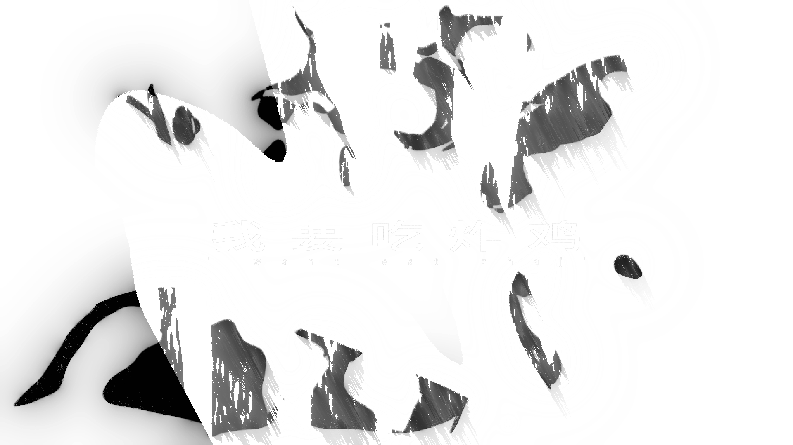
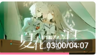
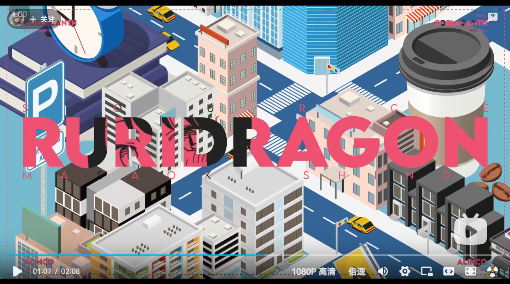

## 扭曲效果的快闪
- 就是一帧一帧做
- 每一帧都用扭曲效果鼓捣一下
- 例如
	- 原图放大再放大+扭曲整点其他的效果明显的扭曲再扭曲放大一下这里逐渐缩小了

## 关于构图原理
- 就是前景，主体，背景，和辅助元素没了。
- 主体突出，前景光效，辅助元素在前后景都可以加入。
- 
## 关于拉镜静止的问题解决办法
- 就是摄像机绑个空对象然后做进场和出场的动画，中间会留出一段时间静止不动
- 解决办法是再加一个空对象2，把原来的空对象绑在上边，然后空对象2做微动
- 

## 微动的技巧
- 表达式1：value+\*\[time* -12,0]
	- 含义：当前位置值基础上再以每秒12个像素点的速度向x轴负向移动
	- 可以加在做好的文字动画预合成上
- 
## 抽象分镜——利用蒙版与涂鸦
- 用钢笔工具随便搞一下，再随便加点效果
	- 
- 再加个蒙版
	- 
- 配合效果的关键帧动画就可以做出一些效果了
	- 

## 灵感研究

## 拉片子，学经典手法

- https://www.bilibili.com/video/BV152421Z7Dg/?spm_id_from=333.999.0.0 作者：Kiryuuu_  https://space.bilibili.com/38042713
	- 一些视觉动画技巧
		1. 文字动画
		-  
		- 拆字后每个字的动画需要有至少两种动画步入位置是最好的
		- 但是如果每个字都有一种动画也不错，发现在竖直方向上的动画不错
		- 每个字出现时间要隔个几帧
		2. 转场
		- 
		- 模糊转场
		- 
		- 素材光效转场
		3. 调色
		- 
		- looks等
- 
	 https://www.bilibili.com/video/BV1QE421w7oR/?spm_id_from=333.337.search-card.all.click&vd_source=53c10533354ac0258467fd99febacd74  --  作者：ALINCO
 - 一些喜欢的设计
	 - 使用线条+摄像机运动的引导视线并介绍角色，漫画使用风格化调色，背景的虚线也有流动动画，线条是多个一起的，应该是加了**修建路径做动画**，整体有流动的氛围
	- 这里的抖动很有轻松诙谐的氛围，我猜是**wiggle+低帧**效果（在时间效果里那个）做的，这里加了一些粒子凸显爆炸的感觉？
	- 这里配合音乐节奏用了很简单的转场效果（裁剪动画），但为什么我觉得很有趣呢，因为这个mad最大的特点就是干净极简且风格化，这里要注意的点是，看着很简单，但还是有小细节的，比如**人物描边抖动和中间的05文字**，这样可以使得整个画面有张力（？
	- **keypoint 1****模糊切镜**，效果好又方便，好看滴很呐，应该使用diffusion做的，然后这里好玩的一点是**摄像机+wiggle然后人物本身的一些动态**，这其实是表现人物的一种独特性的手法，我要抄了
	- 首先是动画很吸引我，这里给每个漫画都做了**裁剪的动画（用蒙版就行）**，挺有意思，然后加了**湍流**使得画面一直有变化最后一个分镜也是**模糊进场**的
	- 这里的老相机画框加上滤镜会有一种回忆感（？，然后呢是比较常用的手法——就是摆一堆图片然后用摄像机运动来展示，不过时不时放大一下也可以卡卡音乐节奏
	- 很有趣的这里是三个分镜的线性展示——扔球动作-保龄球击中动画-欢呼，但是不是切镜，而是在水平空间上保持了连贯性，摄像机运动曲线大概是慢快慢，应该在z轴上也拉了点距离，调色风格化。
	- 最后一个这里用人物做蒙版然后展示之前的动画，水分镜大法好。
## 平面设计编排
- **当今的人们更愿意选择醒目 有吸引力 有兴趣的信息进行阅读**
- 三率一界
	- 版面率：文字与图片占据画面的比例
		- 版面内部的信息数量与元素的面积占比，版面留白，图片留白
		- 版面率高——活泼热闹冲击力强
		- 版面率低——典雅宁静有格调
		- 取决于想要表现出的气质风格是什么
	- 图版率：图片占据画面的比例
		- 提高图版率可以活跃版面，越高视觉冲击力越强
		- 图片的视觉冲击力比文字高得多
		- 但是图版率越高不一定能活跃版面（特别是图片本身如果偏向安静，严肃，低沉），但还是能放大气质
		- 图片像素过低 or 尺寸受限的解决办法：
			- 填充底色
				- 搞个纯色背景，颜色要么搭配，要么对比，要么互补
				- 这是一个色相环
				- ==互补色指在色相环上对立（180°）的两个颜色，色相环上夹角呈现一条直线，==例如我们常见的黄色和紫色、橙色和蓝色、红色和绿色等。互补色的特点是色彩对比非常强烈，在颜色饱和度很高时，能够产生非常鲜明的视觉效果，给人一种潮流、刺激、兴奋的感觉。
				- ==对比色指在色环上相距 120°～180°之间的两种颜色，==也是两种可以明显区分的色彩，对比色能使色彩效果表现更明显，形式多样，极富表现力，能够突出不同元素之间的差异。常见的对比色包括黑白、红绿、蓝黄等。
				- 更多信息详见[[对比色有哪些颜色？设计大神私藏手册！]]
				- 
			- 图形叠底
				- 就是用（设计好的）几何图形作为背景
				- 还可以用设计过的文字作为背景（比如直接放大文字铺满背景）
			- 重复图片：字面意思
		- 控制在30%-70%之间
		- 
	- 跳跃率：元素间的大小对比
		- 在版面中看最大元素和最小元素的对比
		- 图片，文字可以做进行对比的元素
		- 对于图片：
			- 主体顺序：人＞其他生物＞非生物
			- 内容顺序：图片中内容丰富程度越高越需要放大，从而呈现细节
			- 与其他图片有较大差异/不同/特殊的要优先放大，来源于[特异构成](特异构成.md)
			- 只有少量特写图时，特写图放大
			- 但如果有很多特写，少量全景图或者其他，那特写就不放大了
		- 对于信息文字：
			- 不能模棱两可——存在对比的两组文字的字号不能没有较大差距，否则无效
			- 不能对比极端——存在对比的两组文字的字号不能有非常大差距，否则不协调
				- 如果对比极端了，可以通过在两组之间加一组中间字号的文字，做过渡
			- 可以用等差，等比，斐波那契（也就是黄金比），等等的数列来辅助设计
		- 对于装饰文字：文字图形化
	- 视界
- 构成：
	- 
	- 

## 背光
1. 加个投影（在透视-投影）效果，然后选上仅阴影，调一下角度，距离，柔和度
2. 再加个cc compisition，取消仅RGB然后选behind放后边
3. 再加一个设置遮罩（在通道里）效果，ok了

## 纯色人物的“风格化”
- 效果
- 步骤：
	1. 加色调
	2. 加曲线，后期用来微调的
	3. 加色调分离（风格化里），调一下，后面感觉不行还可以微调
	4. 再加个三色调，或者cc toner啥的
	5. 效果：

## 纯线稿提取
- 加卡通效果（风格化里），然后改成边缘，宽度调小点就可以出效果了
- 加个线性颜色键（抠像那里），然后吸个底色（一般都是白色）
- 效果：

## 一种好看的人物描边办法
- 唉蟑螂：
- 步骤：
	1. 选中图层，右键选择图层样式中的描边，调调颜色（靠近人物的那层描边）
	2. 选中图层，右键选择图层样式中的投影，然后距离拉到0，扩展打满，改改颜色（就是最外层的描边了）
	3. 欧克了

## 如何存动画效果预设
- 首先选择给图层加的一些**效果**和图层中属性比如上边的这个人物描边的**描边和投影**，然后在ae上边标题栏这边展开”动画“，然后保存动画预设就行了
- 要调用的时候在动画里找动画预设就行了

## 待续