## 1. 准备工作

首先要做的事是——创建文件夹

这样才能井然有序的进行制作

assets——放资产，字体，图片，音效等等
scenes——就是放场景的
scripts——就是放脚本的

## 2. 基本概念

- 总之就是，节点（node）构成godot内的游戏世界的万物
- 但是呢需要用场景（scene）来把一些基本的东西分开整理好
	- 比如主角可以由很多节点构成，然后单独放入一个场景里
	- 地图也有很多不同的场景，那么也可以单独把每个用节点制作的地图用场景（scene）分开
	- 关卡（level）的载体当然也是场景，也是由节点组成
- 嵌套（mesting）：就是场景之间的嵌套
	- 比如主角场景，地图场景，硬币场景这仨个都放在一个关卡场景里
- 然后场景也可以重复使用，比如某个关卡场景需要很多个硬币场景
- 场景树（scene tree）：也就是场景之间的嵌套关系构成的树状结构
	- 
	- 上边会有一个最开始的节点，称为根节点（root）

## 3. 动手吧

- 创建一个node节点并命名为Game

然后ctrl+s保存在scenes里

- 然后点播放键运行这个项目，并设置主场景为Game（选择当前就行了）

接下来我们来制作主角

- 点击加号创建场景
ctrl+a找到characterBody2D并创建

然后我们需要给他一个视觉表现，也就是添加一个图片节点（sprite2D，这个sprite是图片的意思），但这是静态的没什么意思，那就添加一个动态的动画节点（AnimatedSprite2D）

也就是添加一个这个子节点

然后点击这个animatedsprite2d节点保证是亮着的，然后在右侧的属性里找到spriteframes
添加一个新的spriteframes

单击一下这个

- 再点一下这个
	这是用来导入人物的立绘表的
	- 双击这个knight,它长这样
- 但是很明显这个没框住单个人物，那么在这里改成8就行了
	
这样就对了

IDLE——待机动画

按照这个顺序选择图片，那么人物会照这个顺序动

按F聚焦中心，可以看到我们的角色了

但是发现它很糊，那么我们需要关闭纹理平滑

在项目设置里找到纹理改成nearest就行

- 这样就好多了，可以点击这里播放看看

- 这里可以改成10 fps，就会变化的更快

- 这里名字改成待机动画（idle）

- 然后这里点一下
- 稍微移动一下人物
- 让他站在线上

但是捏注意到上边有一个

点一下看看

很明确，我们要加一个节点来做参与物理碰撞的检测形状

那就加一个

新建圆形

然后调整一下

经验——一般来说不需要完美覆盖人物，甚至只需要人物图像包含整个形状就行

根节点改成player然后保存到scenes文件夹里

回到Game场景里把player拖进去

然后，需要有一个摄像机，来控制游戏显示的东西
添加一个camera2D节点
记得要放在Game下边，不是player下边

然后我们就能看到这个相机的尺寸了

在右边改成4 * 4的就行

然后把相机中心拖到player上

播放试试，ok没问题

## 4. 让人物动起来

回到player场景，在player节点上新建一个脚本，记得放在scripts里，当然我们使用模板文件就行

但是现在我们播放这个场景，角色就会掉下去，因为这个角色下边啥也没有嘛

我们在Game场景里加一个staticbody2D（2D静态物体）节点，当然，别忘了碰撞形状节点

然后创建一个这个世界边界图形

然后点击这个staticbody节点切换到移动模式移动一下位置到玩家下边
注意别只移动collisionshape2D节点。

播放看看效果，ok

但是移动太快了，那就修改一下脚本吧
速度和跳跃速度改成这样

就正常了

## 5. 创建世界

现在我们把这个静态物体节点删了，还是得有个样子的环境才行嘛

然后添加tilemapplayer，别添加tilemap因为

介绍TILES（瓷砖）世界的概念：就是在一个平面网格中给每一个小网格添加图块来构建2D世界
这样的

然后这些不同的图块自然也集合在同一张图中，成为TILESET

就和前边的人物一样的

 那么这个tilemapplayer节点就是用来构建这个tileworld的

首先像之前配置人物那样，新建一个
然后检查一下tile的尺寸
和我们的素材中的每一个tile尺寸大小时不时一致的，不一样要调整
然后呢，要先在下边载入tileset

在左边的资源管理器里拖进来就行

点击是，就欧克

然后捏，把窗口放大，处理一下这个tileset

处理啥呢，要把它错误区分的图块修正
比如这个本来是一个树的图块，它砍成了3个网格
那我们就点击橡皮擦

然后单击这些块让他们变灰
然后再点一下橡皮擦退出擦除模式

然后是从一个合适的格子开始，按住shift同时鼠标单击并拖到覆盖完这个图块的最后一个格子

然后就行了
这就显示一个整体的图块了

呃呃，好像就是三个格子就可以了，别动。。。。。这个可以设计不同高度的树木图块。。

按ctrl+z撤回把

但是把这个搞一下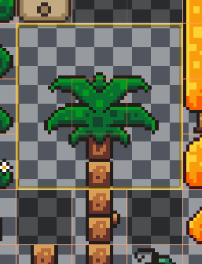

接下来点击tileset旁边的tilemap开始拼图

确保这俩按钮是选择上的

我稍微微调了下这个tilemapplayer的位置

ok，然后呢，在下方左键单击选中一个图块/tile，也可以按住左键点击拖动选中多个图款然后在屏幕上的格子中铺图块吧

左键填充格子，右键删除格子中的图块，也可以长按左键填充，长按右键删除

效果如下

再说一下这个五个功能中，前一个是选择功能可以用来移动tiles，后边都是创建tiles的方式，单击，直线，矩形，油漆桶，
油漆桶是这个效果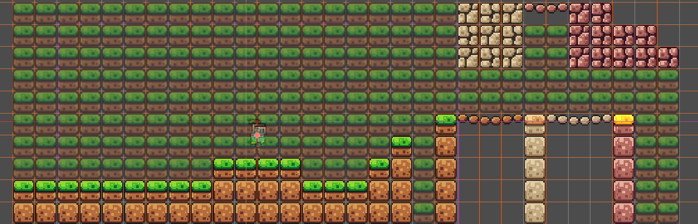

然后捏，可以加一些装饰，巧妙用一下这些素材

这样

做完了，别着急运行这个场景，毕竟和之前一样，这些tiles都没有物理层，主角还是会掉下去的

添加物理层的方式：
先找到物理层

然后添加元素，那就加好了一个物理形状

再在下边的tileset，选择绘制
然后选择属性里的物理层就看到了

然后单击选择（当然可以拖动选择）你想让玩家与其产生碰撞的图块
F键可以切换到选择模式，C键可以切换到取消选择模式

但是对于绳索我们只需要碰到那么一点而不是整个方块，那么就可以在左边这里编辑整个物理层形状

通过添加顶点，移动顶点调整到合适的形状，然后再单击选择右边的图块就可以恰好覆盖了

效果是
这样子

哦对了，可以在这里把形状变回正方形

然后把这个map节点放到最上边

然后来运行一下场景试试，ok没问题，但是摄像机不跟随主角移动。

解决办法是把camera节点移动到player下边，直接拖动就行

然后打开这个相机位置平滑

这下有感觉了，但是player掉下去后不会重新开始，需要改改

## 6. 移动平台

这可以增加游戏的可玩性

那么这种平台自然需要一个新的场景来构建

在新的场景里我们添加animatablebody2D节点

然后添加一个sprite2D子节点作为立绘

然后直接把platforms.png拖进texture就行

在2D视图里我们就能看到了

这么多肯定不是一起呈现，所以我们进行一下裁剪
把这个region的enabled打开
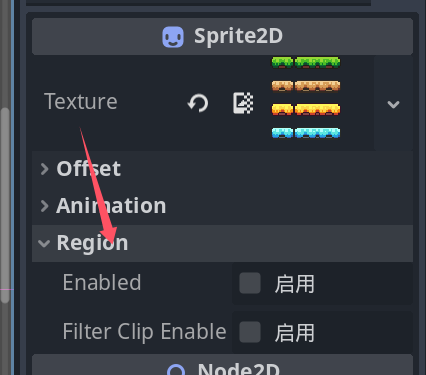

然后点击编辑
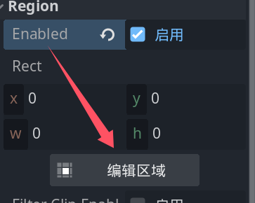
再编辑就行了
记得把上边的吸附模式改为像素吸附

调整完关了就行

这里说明我们还得加一个collisionshape2D，加长方形的就是了

这样就行

养成好习惯，命名

保存在场景里就好
切换到Game场景里

我们直接拖过来

注意一下==一定要在根节点下啊啊啊==
不然会导致整个平台跟着玩家动

运行一下，ok没问题

但是捏，这个平台我们得能从下方跳上来

所以修改一下吧

回到platform场景，点击collisionshape2D节点，把这个单向碰撞

但是呢，我们是从平台的这个立绘的背后跳上来的，而不是正面
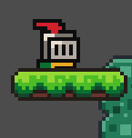

这个原因呢是godot引擎的渲染机制，就像下边这样

意思就是平台这个立绘比人物立绘先渲染

- 所以解决办法是
	- 要么我们把这俩顺序调换一下
	- 要么我们直接就把z轴改了，这样不管先后渲染都有明确的视觉呈现关系
		- 回到player场景，把这里改成5就行了

我们在另一个地方放平台作一个移动平台吧

然后我们在Game场景下，对这个platform节点添加animationplayer子节点

然后在下边
新建一个move动画

然后点击platform2节点，在右边的node的transform属性里

这个就是我们的k帧用的按钮

调整一下第0帧时刻的位置

然后如果发现时间线界面不见了，要先点这个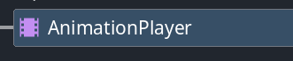再
在底下

点这个动画就出现了

单击刚才说的那个钥匙按钮
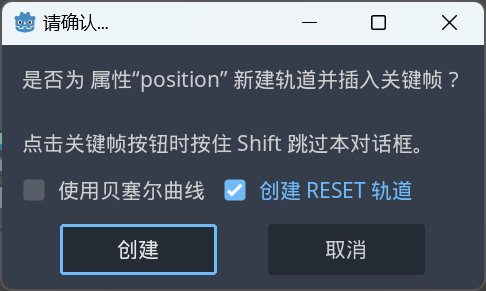
点击创建就可以了
这样就出现了第一个关键帧
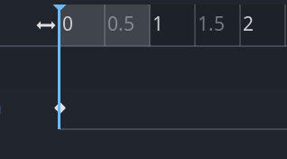

这里我们在这里调整到第1秒

然后再调整平台的位置（可以按住shift键进行平行位移，或者直接改这个transform里的position的数值）

再点一下钥匙按钮就创建了第二个关键帧

点这个就可以播放了，ok，效果可以
右边有一个循环按钮，点亮后再按播放就可以循环播放

但是再点一次就会进入“pingpong”循环
就是正着来和反着来

这里是动画总时长

所以，修改的时候记得要改这里要改

然后可以拖动关键帧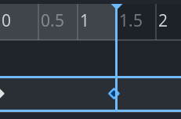

这样子就行

最后一步，把这个自动播放按钮点上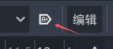

就可以保存运行看看了

## 一个硬硬的东西——coin

新建一个场景

我们需要一个Area2D节点来检测碰撞物体并做出变化

同样的，静态的图片选择sprite2D，动态变化的要选择animatedsprite2D
选择animatedsprite2D

和之前操作一样

记得调整一下网格大小 

这里改成10 fps

 记得都点上

然后添加collisionshape2D，加个圆形

然后改个名

保存到场景（scenes）里

回到Game主场景里，像之前一样把coin拖到场景里就行，然后我们可以用ctrl+D来复制节点

随便放一下

保存并运行一下，ok

接下来要给硬币加上一些脚本，让主角能获取硬币

回到coin场景，我们来添加脚本

设置如下

然后呢，删除这些多余的东西

我们需要用到特定的信号（signal）来触发硬币脚本运行

点击area2D再在右边点击“节点”就可以看到很多信号，这里我们需要body entered信号

双击然后创建

就有了这个函数了

测试一下

运行，ok

但是问题来了，此时任意物体进入这个硬币的检测区域都会发送信号并执行print语句，这并不是我们想要的，我们只要当玩家进入硬币区域才会执行print语句

解决办法是
- 1是写一个判断代码，判断进入检测的物体是否为角色，进而决定是否执行print代码
- 2是可以把玩家放在另一个物理图层上
	- 介绍一下这俩
		- 这个是指可以扫描的物理层有哪些
		- 这里是指这个节点存在于哪些物理层中
	- 这里的物理图层指的是玩家根节点上的collisionobject2D属性里的图层
	- 
	- 我们把Layer里的1换成2这需要我们先点一下1再点亮2
	- 再来到coin场景里，把mask改成这个
	- 这样就行了

然后，我们希望玩家碰到coin后，coin就会消失

那么加一个queue_free()函数——这是一个用来清除节点的函数

就实现了

介绍：

## 7. 欸，你怎么私了——死亡机制

这里首先设置一下相机，让相机不会跟着主角一起掉下去

这里我们在相机的limit属性里修改即可

在上边找到尺子按钮（也就是测量模式）
并选择

然后我们量一下，记得要从这个坐标轴先开始量

差不多是90，也就是说底部（buttom）最大限度是90

顺便把这个平滑开了

这样就不会一直下去了

 接下来，让我们创建一个新场景，我们需要一个检测区域
创建area2D节点，记得把collisionobject2D属性的mask改成2，毕竟我们的主角现在存在于第二个物理层

改为killzone，这是一个我们想要复用的场景，就是说，我们要需要在这个节点下创建不同形状的碰撞区域（collisionshape2D节点）

回到game场景，我们可以点击

来选择这个场景（和拖进来一样的）

记得要让他在根节点的下边，而不是子节点的下边

 ok，在killzone节点下新建一个collisionshape2D节点
 
 创建这个

然后点击killzone节点调整一下位置（反复强调）

这样子，别担心，这个是一个无限长平面。

ok，碰撞区域有了，我们还需要脚本来判断主角是否死了

回到killzone场景，新建一个脚本，这次选择空模板的脚本吧，记得放在scripts文件夹里

然后和前边一样，选择根节点，然后在右边的信号里找到 body entered信号双击创建

然后写上print

ok，这下有提示了，我们还需要一个倒计时来提示玩家多久重启游戏

需要用计时器（Timer节点）节点，那就创建一个

把计时的时间改短一点

然后我们需要在脚本中引用它，怎么办呢？你不知道引用的语句，没事
先点击这个节点然后拖拽到**脚本界面**，先别松手，按ctrl再松手

就有了
如果没按ctrl就会是

这是计时器节点的路径，直接这么写没用，还会报错

然后我们写一下

然后计时器启动了就应该会发出信号，啥呢，timeout信号

所以接下来我们要创建这个信号

这个函数会在计时结束时触发执行

根据前边讲的渲染顺序，我们需要用场景树

- 解释：
	- 
	- 

## 环境设计2.0

虽然复用场景已然帮我们整洁了主场景的节点

但是太多了

有什么办法可以再整理整理，归归类呢
在场景栏里我们只能添加节点，但是根据节点的父子关系，我们可以将节点当作文件夹来使用
比如Node节点

让我们整理一下

ok，好多了

再优化一下世界

ok，没有背景感觉怪怪的，那就再加一个tilemaplayer
原因：

和之前同样的操作
不过这次不用设置物理层
需要把z轴调一下

负的就行
效果

然后，我们来保存运行一下，ok没问题

## Enemy——敌人

有个可攻击对象会很爽

由于此处不需要像主角那样有一个物理碰撞的效果（比如主角不能穿过敌人，但是现在不需要）
那就只需要一个普通的2D节点——Node2D节点就行了

新建场景，创建根节点，然后这个敌人也得是动态的吧，那就加一个动画图片节点——animatedsprite2D

和前边一样，新建spriteframes，然后以精灵表（其实就是网格切割为小图块）的方式导入合图（包含所有立绘状态的图）

调整一下

按顺序导入吧
第一行是怪物苏醒
第二行是待机
第三行是收到攻击
改改设置
待机动画就做好了，现在我们需要利用之前创建的killzone来给敌人设置死亡机制

点这里实例化这个killzone场景，然后添加一个collisionshape2d节点，新建一个形状覆盖住敌人（按住alt键可以居中调整形状）

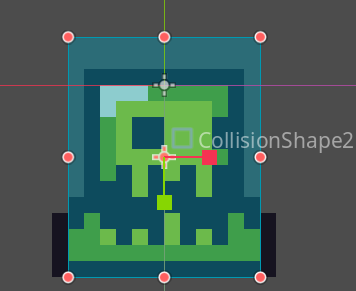
像这样。

这是一个slime（史莱姆）

然后改名保存到场景里

然后再game场景里拖入这个怪物吧

运行试试看，ok，确实有效果

ok，接下来让我们的史莱姆移动起来
这里可以通过动画节点来做到移动，但是，我们想让它在不同距离的墙里有同样的左右移动行为，那么就需要脚本了

那么就新建脚本吧，记得放在scripts文件夹里

把ready函数删了，留个这个

一些原理介绍：
- ready函数只会在进入场景后的开始执行一次，但是之后就不会了
- 而process顾名思义就是在游戏运行的每一帧都会执行

这就适合我们做一些关于敌人自动移动的操作

然后呢这里有个小知识，游戏内的帧率众所周知是非固定的，那么这个process函数执行的速度也是不固定的。

这里呢写脚本前再需要一个概念——射线投射节点（raycast2D）——发射不可见的射线来探测障碍物距离

这样子，让我们调整一下

由于之前没把slime放在线上，这里调整一下

ok这是一个右侧射线，现在我们还要一个左侧射线

缩进去一点，这样就对了，再改个名

然后来到脚本界面，像之前做的那样，ctrl拖入这两个节点

现在开始写脚本

- 解释：
	- @onready 是一个注解，表示这些变量将在节点树准备好后自动初始化。
	- ray_cast_2_dright 和 ray_cast_2_dleft 是两个 RayCast2D 节点的引用，分别指向场景中的 RayCast2Dright 和 RayCast2Dleft 节点。
	- RayCast2D 用于检测指定方向上的碰撞。
	- SPEED 是敌人的移动速度，单位是像素/秒。
	- direction 是敌人的移动方向，1 表示向右移动，-1 表示向左移动。
	- - `_process` 函数每帧都会被调用一次，`delta` 参数表示从上一帧到当前帧的时间间隔（以秒为单位）。
	- 在每一帧中，脚本会检查 ray_cast_2_dright 和 ray_cast_2_dleft 是否检测到碰撞。
		- 如果 ray_cast_2_dright 检测到碰撞（即右边有障碍物），则将 direction 设置为 -1，使敌人向左移动。
		- 如果 ray_cast_2_dleft 检测到碰撞（即左边有障碍物），则将 direction 设置为 1，使敌人向右移动。
	- 最后，根据 `direction` 和 `SPEED` 更新敌人的位置：
	    - `position.x` 是敌人的X坐标。
	    - `direction * SPEED * delta` 计算出每帧应该移动的距离。
	    - `position.x += direction * SPEED * delta` ==更新敌人的X坐标，使其向左或向右移动，这是一个通用公式。==

然后呢，敌人移动方向变了，自然立绘也要翻转
那就需要在脚本中对animatedshape2D节点的flip h属性做控制

当然不能直接修改这个flip h，而是先引用这个animatedshape2D节点

稍微改了下变量名

然后就可以想调用python方法那样来调用这个节点的属性

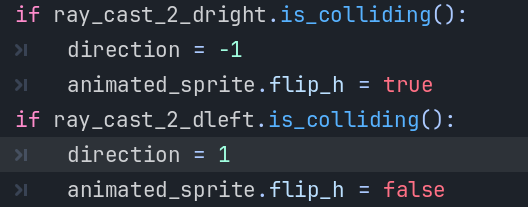

这样就行了

## 更好的死亡，怎么会有人喜欢关注自己怎么似的

这可以通过改变游戏的时间尺度（时间流逝速度）来实现

来到killzone场景脚本加入这些代码

上下都调用修改了Engine的time_scale属性，一旦碰到就打印，然后把游戏时间尺度变慢，计时结束重启游戏前把时间尺度调回来，这样就可以了

接下来，我们再加入一些细节，比如
让主角进入killzone后直接失去物理层然后掉落

也就是清除物理层了，想起来之前做硬币时有个queue_free（）函数，那么就可以在这里使用
回到killzone场景脚本里，加入下边的代码

这里的body就是这个killzone所接触的物体，也就是我们的player，这样就可以调用对应的物理层也就是collisionshape2D节点再调用queuefree方法就行了

## 更好的玩家——让我看看！（player的脚本里写的是啥）

首先区分以下process和physical process这两个函数

前者是根据实际游戏运行帧数来执行对应代码的
而后者则是严格地在固定的帧数上以相同的时间间隔来执行代码的（一般是60帧/秒）

现在看看这个模板代码写了什么
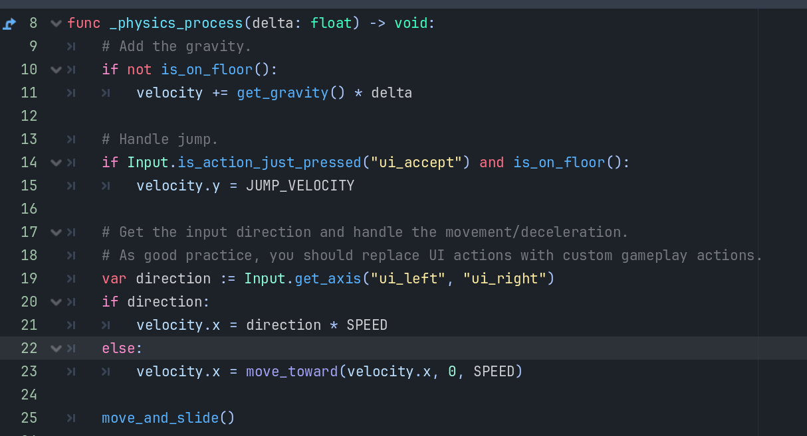

> [!NOTE] `_physics_process` 函数内部
>**重力处理**
如果玩家不在地面上（即没有接触地面），则应用重力。`get_gravity()` 返回当前世界的重力向量，乘以 `delta` 时间间隔后加到 `velocity` 上。
**跳跃处理**
检查是否刚刚按下跳跃键（默认为 `ui_accept`，通常是空格键或回车键）并且玩家在地面上。
如果满足条件，则将玩家的垂直速度设置为 `JUMP_VELOCITY`，使玩家向上跳跃。
**输入方向和移动处理**
`Input.get_axis("ui_left", "ui_right")` 获取水平输入轴的方向。`ui_left` 和 `ui_right` 是默认的输入动作名称，分别对应左移和右移。
如果检测到水平输入（`direction` 不为0），则将玩家的水平速度设置为 `direction * SPEED`。
如果没有检测到水平输入（`direction` 为0），则使用 `move_toward` 函数逐渐将水平速度减小到0，实现减速效果。
**移动和滑动**
`move_and_slide()` 是 `CharacterBody2D` 的一个方法，用于根据当前的速度 (`velocity`) 更新玩家的位置，并处理与地形的碰撞。这个方法会自动处理斜坡、墙壁等复杂地形。

其中

然后呢，这种通过按键绑定来执行动作的机制叫动作系统（action system），知道就行
接下来我们就可以修改一下输入映射

上边代码里有一些默认的输入映射
比如ui_accept,ui_right,ui_left就分别代表键盘的空格键，左方向键，右方向键。
当然我们也可以在

这里手动设置，先在“添加新动作”这一行里填写映射的名称，然后在下边每一个映射右边有个加号键就能添加了
效果

然后我们来改一改

就行了

然后是解决主角的立绘反转问题
同样，先ctrl拖入引用animatedshape2d节点
然后加一段判断语句就行了

注意，这里不要添加等于0的情况，否则会很怪的。

再给玩家添加一些不同状态下的动画吧

来到player场景在animatedshape2D添加两个新动作jump和run，并且我们在脚本中控制这三个动作动画的播放

就ok了

## 文字——你也不想让sensei知道你的哒教对象罢

其实展示文字的方式有很多，很灵活，这里介绍一下常用的一个节点
Label——

在右边的检查器里就可以修改要显示的文字了，自然也可以移动

在这里可以拖入你的字体

好多了

 这里的字体很特殊
 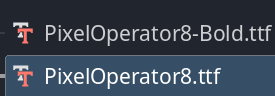
 当调整font size时记得改成8的倍数

颜色在这里改

效果

## 计分系统——你记得今早吃了多少卡路里吗？

很明显，需要代码存储与计算你的得分
需要文字来展示你的得分

新建一个node2D（）节点作为“游戏管理器”

并创建脚本

忘记改路径了也可以手动拖入对应文件夹

 这里呢，由于这个GameManager节点只有一个，我们引用的时候会带着很多../../的东西，这是不好的习惯，所以我们右键它然后选择
 这样引用的时候就变成

那么我们在gamemanager脚本里写

然后在coin的脚本里写

这样就完成了得分的计算与存储
接下来新建一个label放游戏管理器节点里

然后在manager脚本里写这些代码（引用一下label）

就有了

## 音效——做游戏最灵魂的一步

需要Audiostreamplay节点

把资产里的音乐拖过来

启动自动播放

然后双击这个

打开这个

然后重新导入

学习一下这个自带的音频编辑器

添加两个总线，一个是背景音乐，一个是音效

然后在右边把总线改为music

再在编辑器里控制声音

把背景音乐调小吧

问题来了，音乐会随着角色的死亡而重头开始，我们想让音乐自己放自己的，不受角色干扰
那么就可以把它设置为场景，然后在game场景中删掉它

直接拖入就行

然后在项目设置里找到自动加载

这样添加就解决了

然后添加硬币拾起音效

这里有个问题，在脚本中，硬币被检测到时就会被删除，这个时间很短，甚至连让音效播放的机会都没有，所以这里有一个小技巧来解决这件事
- 步骤：
	- 创建一个animationplayer
	- 选中
	- 来到这里并拖到1秒
	- 在右边点这个
	- 然后创建
	- 再拖到1秒
	- 然后把点一下，不启用
	- 这样这个动画结束时硬币不可见
	- 接下来点这个
	- 然后点钥匙按钮
	- 然后再点启用
	- 
	- 
	- 然后
	- 
	- 最后
	-  然后呢回到newanimation
	- 选择这些关键帧
	- 拉到最开始
	- 然后
	- 
	- 选择coin节点
	- 在这里右键
	- 
	- 选择这个并打开
	- 这样就ok了

改一下名字
回到coin脚本
改成这个代码

觉得硬币消失时间太长可以改这里
拖一下就好了

